GPLOT - A Graph Plotting and Drawing Program based on DIMFILM
=============================================================

GPLOT is a graph plotting program, similar in intent to Gnuplot but very
different in detail (and less capable -- although it also does some things
Gnuplot does not). It is intended to run primarily
on CDC NOS 2.8.7, but it will also run on "Unix-like" systems.

In addition to plotting graphs of
data (stored in files), the current version of GPLOT has some features
which can be useful for general drawing, especially of things such as
block diagrams.

GPLOT is based on the DIMFILM library (Descriptive Instructions for MicroFILM)
which was written by Dr. John Gilbert at ULCC between 1972 and the mid 1990s.
The version of DIMFILM used is the second major version, from around 1983.
The first version was CDC specific, while the second was much more easily 
ported and ran on IBM MVS, Cray COS and UNICOS as well as Convex machines.

DIMFILM source was obtained from Dr. Gilbert via Dr. Adrian Clark in 2005.
Unfortunately, due to a malfunctioning RAID controller, the ULCC production
code was no longer available by that point and, to some degree, things had
to be pieced together from multiple sources by Dr. Gilbert. Consequently,
I do not have the original fonts for DIMFILM and the source may be, at least 
partially, an early beta version. I did some work in 2008 to get
it to work using Hershey fonts, and some minor modifications have been made
then and since as needed to make it functional on NOS and "Unix". Only 
necessary changes have been made, though, and they have been few. The
original source as received is also included in this repository.

I am not aware of DIMFILM being preserved anywhere else. Although the code
does not contain any copyright notices, it is the work of John Gilbert.
I am reluctant to include it, but GPLOT is largely a "front end" to it, so
it isn't optional. Also, I fear DIMFILM might be entirely lost otherwise.

Both GPLOT and DIMFILM are written in FORTRAN-77, which was often the
best supported language prior to the dominance of "Unix-like" and Windows
systems. Fortunately, FORTRAN-77 remains well supported today on "Unix-like"
systems thanks to gfortran (along with modern Fortran, which is gfortran's
main focus, of course).

The DIMFILM library can also be cross-compiled and used on the Cray COS
operating system on a (simulated) CRAY X-MP. GPLOT itself is currently
not available for COS, although that should be straightforward to add in
a future "release".

GPLOT and DIMFILM are developed and maintained primarily on CDC NOS 2.8.7.
NOS has its own way of managing source code, at the heart of which is 
a program called MODIFY. 

MODIFY is quite usable, but is radically different from anything seen on
today's mainstream systems. Source is kept in "program library" (PL) 
files which store many modules (often all those needed for a whole
project or a major subsystem) in a single file. Furthermore, those
files are binary and reside in a record oriented file system on what
is now a very obscure operating system.

Obviously, MODIFY and Git are about as incompatible as it is possible
to get for systems that both manage source code! Storing code in Git on
Github is very appealing as far as preservation and accessibility are
concerned, so getting these two systems to work together seemed to be
a useful sub-project.

The GPLOT project therefore establishes a fair amount of infrastructure that
allows MODIFY and Git to inter-operate without too much pain.

Please note that neither GPLOT nor DIMFILM have been built on any version
of Windows. If a good FORTRAN-77 compiler is available for Windows (perhaps
gfortran?), it should be fairly easy to get them working on Windows, but
that is an "exercise for the reader" ... 


MODIFY/Git Interoperability Infrastructure
------------------------------------------

The scheme to have Git and MODIFY cooperate with each other relies entirely
on the extensive network capabilities opened up by Kevin Jordan's fork of
Tom Hunter's DtCyber CDC Cyber 6000 machine simulator. This fork supports
transfer of files with FTP over TCP/IP and running batch jobs with RBF
(Remote Batch Facility) using RJE/HASP. The machine hosting the Git repo
must have Kevin's RJE Station installed so that `rjecli` in that package
works. 

At the highest level, the goals for this interoperability scheme are to:

- Allow the contents of a MODIFY PL on NOS to be transferred to a Git
  repository.
- Allow changes to source code made on NOS and stored in a MODIFY PL
  to update the contents of the corresponding Git repository.
- Allow changes made to sources in the Git repository to update the
  corresponding MODIFY PL on NOS.
  
The top level functionality (all that people using this need know
about) consists of two Bash shell scripts:

- `import-modify.sh`: This imports the source contained in a MODIFY PL
  into a directory, the contents of which can be put under Git management.
- `export-modify.sh`: This exports the source contained in a Git repo
  (with a directory structure created by `import-modify.sh`) to a MODIFY
  PL.
  
To simplify things as much as possible, some pretty rigid naming conventions
must be adhered to.

- The MODIFY PL must be called `PLabcde` on NOS. The first 2 characters 
  must be `PL` followed by 1 to 5 letters.
- The `import-modify.sh` script only needs to be given `abcde` as a parameter (another
  parameter can be given if necessary, as described below).
- The import script will create a directory called: `abcde-library` in which
  the contents of the MODIFY PL will be stored. Each MODIFY PL module will
  be written to a separate file. More details below.
- The export script also need only be given `abcde` as a parameter. 
- The export script will use the contents of the directory `abcde-library` to update
  the MODIFY PL, `PLabcde`. The PL can be created anew or an existing PL can be
  updated using information from Git about what has changed.
  
The `import-modify.sh` and `export-modify.sh` scripts should only be run from the 
root of the Git repo for a project. They both check for this.
  
Updates are made at the granularity of modules (files). MODIFY can track changes at
the source code line level, but this is too hard to do at present and may not
be a good idea anyway.

Git and MODIFY will be running on two different machines (the same physical machine
might be hosting the Git repo and running DtCyber for NOS, but there are still
two logical machines involved). Information about the machines and users must be
supplied so that the "Git machine" can communicate with the "MODIFY machine" and
vice versa.

The setup required for this is done by a file in the Git repo root directory:
```
.modgitproject
```
A boilerplate version of this is created by:
```
modgitinit.sh
```
This can be edited with the Nano editor (which is usually pre-installed on both
Linux and macOS) using:
```
modgitedit.sh "GPLOT and DIMFILM"
```
The contents of this file are:
```
export MODGITPROJECT="GPLOT and DIMFILM"
export NOSUSER=guest
export NOSPW=guest
export NOSHOST=noshostname
export RJEHOME=~/rje-station
export RJESPOOL=${RJEHOME}/spool
```

The contents must be set so that using FTP and submitting batch jobs to NOS with
`rjecli` in `rje-station` (using RBF - Remote Batch facility) will work.
The NOS account given via `NOSUSER`, `NOSPW` and `NOSHOST` must be the one
where the MODIFY PL lives, of course. `NOSHOST` will be the host name or
IP address of the physical machine running DtCyber.

### The `import-modify.sh` script

To populate or update the contents of `abcde-library` from `PLabcde` use:
```
import-modify.sh abcde
```
This is appropriate for MODIFY PLs that contain source code and documentation
modules. 

If a PL module is an ASCII module, it will be converted from 6/12 Display Code
to upper and lower case "normal" ASCII. This will normally only be the case
for documentation modules. In this case, lines may be up to 72 characters long
if they are entirely lower case or 144 characters if entirely upper case or
somewhere in between if mixed case! These modules are stored in files with the
`.asc` extension.

Otherwise, although the file will be "ASCII" (or UTF-8) on the Git repo host 
machine, it will contain 6/12 Display Code sequences unchanged if they
appear in the module source. I.e. no conversion of `^L` to lower case `l`
will be attempted. Using 6/12 Display Code for source code is fraught with
difficulties and in many languages (e.g. FORTRAN) lower or mixed case can
only appear in character (string) constants. It is best to just leave non-ASCII
modules alone and have strings such as `"Hello"` appear as `"H^E^L^L^O"` in the
code. The clinching argument for this (IMO) is that there is often a 72 
character limit on source line length, but if 6/12 codes are presented
as lower case and edited, you won't know when they have become too long!

Note that MODIFY by default will truncate lines at 72 (or 144) characters
itself. It can be told not to, but that tends to cause difficulties, as
you have to remember to "tell it not to" everywhere.

`COMMON` modules marked as such in MODIFY are written to files with the
`.cmn` extension. These are much the same as "include files". Source files
"include" them using `*CALL cmnname` in MODIFY. These `*CALL` lines are 
converted to `INCLUDE 'cmnname.cmn'` to get the same effect for compilers
that can include files on the Git repo host. This sort of file inclusion
can be nested.

An attempt is made to identify FORTRAN-77 source specifically from its
contents. If such source is identified, it is written to files with
the extension `.f`.

All other material (not ASCII, COMMON or "guessed" FORTRAN-77) is written
to files with the extension `.src`.

At present, we do not try to "guess" source code for other languages.

Note that source code files are explictly converted to upper case only
along the way. With the source languages we are currently using, and
the details of how data is transferred, lower case should not appear
anyway (except in "string" constants), but if it does, it is converted 
to upper case.

The entire contents of a MODIFY PL are always processed by 
`import-modify.sh`. All modules are fetched and converted to files every
time the script is run. If a file has been edited in the Git repo, the
*changes could be lost*. To prevent this happening accidentally,
`import-modify.sh` checks if any files in `abcde-library` have been
modified, as identified by Git. If they have, it will refuse to import
anything unless the environment variable `IM_ALLOW_OVERWRITES` is defined.
To allow overwrites for a specific use of `import-modify.sh` while preventing
them otherwise, the following Bash functionality is useful:
```
IM_ALLOW_OVERWRITES=1 import-modify.sh abcde
```

In general, changes should be committed to Git and 
`export-modify.sh` run to update the MODIFY PL to match before 
`import-modify.sh` is used.

MODIFY PLs used to store CCL (Cyber Control Language) procedures need
special treatment. None of the processing described above should be
performed. Instead, the source should be kept as MODIFY source, quite
unchanged. This is done with the `-n` or `--noprocess` option.
```
import-modify.sh abcde -n
```

There are additional options to help with building the source on
Unix-like systems. 

`-s scriptfile` or `--script scriptfile` will create a Bash
shell script to run gfortran on every `.f` file. 

`--omit a,b,c` will omit modules `a`, `b` and `c` from the
script file. This may be needed for modules that are non-standard
FORTRAN (e.g. include COMPASS assembler). These cannot be compiled
by gfortran.

`-l libname` or `--library libname` will add a section to the
script file to insert all the `.o` files from compiling the
`.f` modules into a static library (`libname.a`).

Note that all "extra arguments" must be combined into a 
single parameter with double quotation marks. For example:
```
import-modify.sh dimfm "-s build-unix.sh --omit getbyt -l dimfilm.a"
```

This script generation facility has proved less useful than anticipated,
but it may be helpful in other projects.

### The `export-modify.sh` script.

To populate or update the contents of `PLabcde` from `abcde-library` use:
```
export-modify.sh abcde
```

This will apply processing appropriate to the file type (`.f`, `.cmn`, `.src`
and `.asc`) by default, for example converting `INCLUDE 'x.cmn'` back to 
`*CALL x`. To prevent all processing (e.g. for CCL procedure libraries),
the `--noprocess` or `-n` option is available.

Also by default, only changed files will be processed and used to update
an existing PL. If all files are to be processed and/or a new PL needs to be
created on the NOS side, the `--all` or `-a` option can be used.

Changed files are detected by Git. The default method is to use (internally)
`git ls-files -m` which will find files that have been changed *since* the last 
commit. However, using the `--committed` or `-c` option will look instead at
files that were changed *in* the last Git commit.

### Behind the scenes

The `import-modify.sh` and `export-modify.sh` should do all that is needed to
keep MODIFY and Git versions of the same software "in sync". Those scripts
use some other tools which may be of interest and more generally useful.

The various components involved and their relationships are shown in this
diagram:

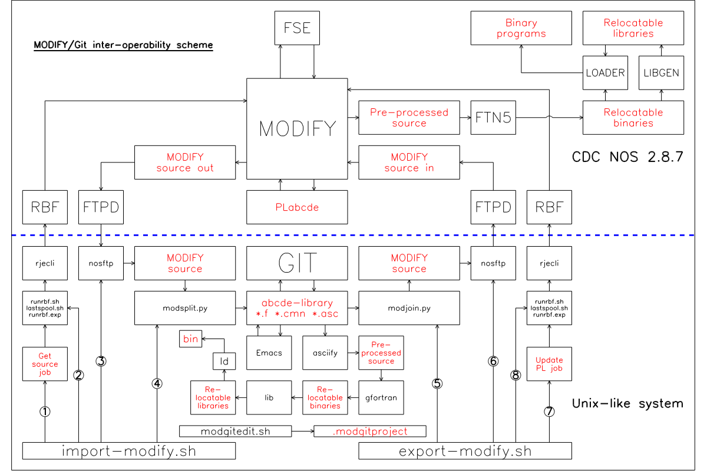

MODIFY source code is extracted from and inserted into PLs by running
dynamically constructed batch jobs on NOS. The jobs are submitted via
RBF (Remote Batch Facility) using Kevin Jordan's `rje-station` software.
The Bash script `runrbf.sh` together with an Expect script called `runrbf.exp` 
run the jobs. To do that, they start an `rje-station`, submit the job by
loading the RJE station's card reader with the job, then wait for the return
of the job's output. The jobs are such that, once the output has been returned,
the job will have been fully processed. The `rje-station` program then exits.
Creating and destroying an RJE Station for each batch job is not great. In the
real world an RJE Station was a large chunk of hardware which would have been
logged in to NOS once and left running while it was used to submit many
jobs. At present, this is a convenient way to do things, but later versions
of these inter-operability tools will hopefully find a way to interact with a
single, long lived, RJE Station instance.

To provide feedback on how the batch jobs went, the `lastspool.sh` script
displays the contents of the latest job output file on `stdout`.

MODIFY source code is transferred to and from NOS by FTP. Although NOS can 
work with any FTP client (probably), there is a tool called `nosftp` provided
which simplifies working with NOS as much as possible. This is implemented by 
a Python program, `nosftp.py` which uses Python's `ftplib` FTP client
library.

Most of the "hard work" is done by two Python programs: `modsplit` for 
MODIFY source import and `modjoin` for MODIFY source export. 

### Installing the inter-operability tools

The tools can be found in the `tools` subdirectory. For the Python
programs, use of a Python "virtual environment" (venv) is highly 
recommended. Python 3.9 or later is needed.

A single venv may be shared between multiple projects,
but creation and use of a venv for these tools is shown for completeness. 
This example venv is called `genv`.

- Create the venv:
```
python3 -m venv ~/genv
```
- Activate the newly created venv:
```
source ~/genv/bin/activate
```

This venv must be active whenever the tools are used.

There are no additional Python libraries or system packages that
need to be installed.

Once the venv has been created and activated, just use:
```
./install.sh
```
in the `tools` directory to install all components. You will
need to be able to use `sudo` and you will be prompted for your
password when running this script.


Transferring all components of GPLOT and DIMFILM between Git and NOS
--------------------------------------------------------------------

Let's assume we start with a clone of the GPLOT Git repository on a "Unix"
system  and a NOS 2.8.7 account with some priliveges (you need to be able to
have a lot of CPU time and disk resources) which has not seen GPLOT before.

First, install the MODIFY/Git inter-operability tools as described above.

Next, configure these tools using:
```
modgitedit.sh
```
also as described above.

There are six major parts to GPLOT/DIMFILM and the environment on NOS
needed to build it.

1. A set of CCL procedures which establish new commands (in effect) which
   are used to build and maintain the source code. I also use these for my 
   other NOS software. They try to make using MODIFY and other NOS utilities
   more convenient and, perhaps, look a bit more like today's mainstream
   systems (although not much like them!). They trade efficiency for
   convenience, but it is unlikely that any NOS system is heavily loaded
   these days (apart from the two public PLATO installations, perhaps).
   This is `PLPROCS`.
2. A PL containing a "utilities library" (source for an object library with widely
   useful functions and subroutines for doing things with character variables
   and interfacing with NOS). There are also a few small "utility programs"
   in the PL that test and use the library. This is `PLUTILS`.
3. A PL containing graphics device output code. This is `PLGRDEV`. It provides
   basic functions that support Encapsulated PostScript (EPS), Scalable Vector
   Graphics (SVG), output to my GTerm "terminal" software and output to
   Tektronix 401x Direct View Storage Tube terminals (which dominated graphics
   devices in the 1970s and early 1980s. Some of this (especially the "serial line"
   output code for terminals) is quite NOS specific.
4. The DIMFILM graphics library. This is `PLDIMFM`. It contains over 500 modules
   with around 25,000 lines of code altogether.
5. The GPLOT program and vector fonts for DIMFILM. This is `PLGPLOT`. 
6. A pair of test and example programs for DIMFILM (separate from GPLOT).
   This is `PLDIMTS`.

To transfer all six PLs from "Unix" to NOS, the Bash shell script:
```
./export-all.sh
```
should be run. This uses `export-modify.sh` appropriately to transfer the full
contents of all the PLs to the NOS account set up with `modgitedit.sh`.

There is one other file which should be moved to the NOS system: `PRLOGIN`,
which is set up as a "login script" to be run when the account logs in.

To send that to NOS:
```
cd nos-tools
./send-files.sh
```
This uses `nosftp` to send the file `prlogin` to the account defined with
`modgitedit.sh`.


Building all components of GPLOT and DIMFILM on NOS.
----------------------------------------------------

The first step is to set up the CCL procedures in `PLPROCS` so they can be
used in subsequent steps. This only needs to be done once for an account,
unless the procedures are themselves changed by the user.

### Installing the CCL procedures in PLPROCS

Login to your NOS account (using an interactive session) in the usual way.
Then use these commands:
```
GET,PLPROCS.
MODIFY,P=PLPROCS,C=BUILD,L=0,S=0,Z./*EDIT BUILD
BEGIN,BUILD,BUILD.
LIBRARY,USERLIB.
UPROC,PRLOGIN.
```

This creates a CCL procedure library called `USERLIB` and sets it up in the
library search list (a bit like changing `$PATH` on "Unix" systems, but not
really). It also sets `PRLOGIN` to be the "script" run on login. This sets
up `USERLIB` on login so it is available and also lets the user pick from 
a list of terminals for the interactive session (so that the Full Screen Editor
- FSE - "just works"). You may want to modify this part, depending on which
terminal emulator you use. 

### Build the utilities library from PLUTILS

The PLs in this software contain procedures for building the "products" whose
source code is in the PL (or a related PL in some cases). This permits a way
of working which is a bit like using `make` on "Unix-like" systems (but,
again, not really). To build the utilities library and related programs use:
```
GET,PLUTILS.
MODEXEC,BUILD,PLUTILS,OPT=2.
```
This uses the `MODEXEC` procedure defined in `PLPROCS` to run the `BUILD` procedure
found in `PLUTILS`. This is how `PLUTILS` can contain the instructions needed to
build it and make running those instructions very easy.

The end result of this is an object library called `LBUTILS`, which GPLOT needs
to link with later. A secondary result is a library of executable binaries
called `BINLIB`. One way of making the programs in there available as if they were
commands is:
```
ATTACH,BINLIB.
LIBRARY,BINLIB/A.
```
Three programs in there that might be of some use are `DATE`, `UPTIME` and
`WHOAMI`, which more or less do what you might expect them to!

To list the contents of a "library" (object, procedure or exectable program),
the `PLPROCS` supplied `MODLIST` can be used. E.g.:
```
/modlist,binlib
          CATALOG OF BINLIB         FILE    1
    REC   NAME      TYPE          LENGTH   CKSUM     DATE

      1   BINLIB    ULIB              20    7550  25/06/26.
      2   DATE      ABS            12505    5125  25/06/26.
           DATE         125
      3   DECFL     ABS            23340    7725  25/06/26.
           DECFL        125
      4   ENCFL     ABS            21702    3672  25/06/26.
           ENCFL        125
      5   UPTIME    ABS            12535    1131  25/06/26.
           UPTIME       125
      6   WHOAMI    ABS            12643    0777  25/06/26.
           WHOAMI       125
      7   BINLIB    OPLD              15    6232  25/06/26.

      8   * EOF *       SUM =     105404
```

Note the `OPT=2` argument for full optimisation (more or less) when code is
compiled. If this is omitted, no optimisation is performed, which will also
be the case if `OPT=0` is given. Levels 1 and 3 are also available, with 3
running cross-procedure optimisation. Refer to the appropriate CDC documentation
for details.

### Build the graphics device support library from PLGRDEV

The build procedures for this library, DIMFILM and the GPLOT program all
reside in the `PLGPLOT` program library.

This creates the `LBGRDEV` object library:
```
GET,PLGPLOT.
GET,PLGRDEV.
MODEXEC,BUILD,PLGPLOT,ARG=DEVICES,OPT=2.
```

### Build the DIMFILM library

This creates the object library `LBDIMFM`:
```
GET,PLDIMFM.
MODEXEC,BUILD,PLGPLOT,ARG=DIMFILM,OPT=2.
```
This is likely to take several minutes.


### Build the GPLOT program and extract the font definition file

Now that all the required object libraries have been built, the GPLOT
program itself can be made. This will do that:
```
MODEXEC,BUILD,PLGPLOT,ARG=GPLOT,OPT=2.
```

There are two results. The executable binary is written to a file
called `GPLOT`. This can be used in later sessions (by this account)
with these commands:
```
ATTACH,GPLOT.
GPLOT. (etc., see below)
```

The second result is the creation of a file called `DADIMFO` which
contains data that defines the vector fonts used by DIMFILM.


### Build the DIMFILM test programs

It is possible to use DIMFILM to provide graphical output from programs
other than GPLOT, of course, by writing a program (usually in FORTRAN-77)
and linking it with the DIMFILM library and support libraries.

Two "test programs" are supplied both to help verify DIMFILM is working
correctly and to serve as examples of how to write programs that call it.

- DIMTEST produces 10 frames of output, exercising much of the graph
  plotting functionality of DIMFILM.
- LSTDFON produces 24 frames, one for each available font. Each frame
  is a font table and the full set is a complete font catalog.
  
To build these programs on NOS:
```
GET,PLDIMTS.
MODEXEC,BUILD,PLDIMTS,OPT=2.
```

To run them, first `ATTACH` the fonts file (GPLOT does this internally,
so the user doesn't have to remember to do this) then run them by name.
```
ATTACH,DADIMFO.
ATTACH,DIMTEST.
ATTACH,LSTDFON.
DIMTEST.
LSTDFON.
```
The output of DIMTEST is a set of EPS files named `NW001` to
`NW010`. The output of LSTDFON is also a set of EPS files called
`FON001` to `FON024`.


Using EPS and SVG files created on NOS
--------------------------------------

There is no direct way of viewing EPS or SVG files on NOS. They must
be viewed on systems which can display PostScript or PostScript converted
to PDF for EPS files, or in a browser for SVG files.

On NOS systems running the NOS HTTP server, the SVG files could be transferred
to the WWW account and viewed with any web browser on almost any other system.
There is another piece of NOS software which implements a Markdown-like scheme
for writing and posting "notes" on the NOS HTTP server which integrates with
GPLOT using SVG output from graphs and diagrams. This is not described here,
though.

However, it will often be useful to copy both EPS and SVG output as files
to "mainstream" systems for further use. This is most easily done with
`NOSFTP`. These files contain lower case characters and should be treated
as ASCII. For example:
```
$ nosftp tester nuc1
Password for NOS account: 
Contacting NOS FTP server on host: nuc1
230 USER LOGGED IN, PROCEED.
220 SERVICE READY FOR NEW USER.
Local cwd now: /Volumes/qemu-main/gitprojects/gplot2

NOS FTP> get nw009 nw009.eps ascii
... retrieving file: nw009
226 CLOSING DATA CONNECTION.

NOS FTP> bye
```

Further developing this software
--------------------------------

Once the above transfer and build procedures have been carried out,
further development work on GPLOT or any of its components can be 
carried out on NOS or the "Unix-like" Git host machine, and the
MODIFY and Git representations of the source can be kept in sync using
`import-modify.sh` and `export-modify.sh` as described above.


Building all components of GPLOT and DIMFILM on "Unix".
-------------------------------------------------------

It is straightforward to build DIMFILM and GPLOT on "Unix-like"
systems such as macOS and Linux. As far as we are concerned for
this project, all these systems are almost identical.

The main requirement is that `gfortran` is installed and working,
along with the usual C/C++ development environment that is always
available on these systems. As part of the GNU Compiler Collection,
`gfortran` is also readily available. 

Note that the "Unix" versions of DIMFILM and GPLOT are *ports* of
the NOS version. The NOS code is quite portable (well, to a 
`gfortran` environment -- some features such as 7 character variable
names might cause trouble with strict FORTRAN-77 compilers). It turns
out that a very small amount of conditional compilation (supported
by MODIFY and the C Pre-Processor) and a small "support library"
that provides some functions compatible with NOS and FTN5, is almost
all that is needed. A very small number of other incompatibilites
are handled by string substitution using the `asciify` tool. These
are primarily to cope with the highly non-standard `PROGRAM` statement
FTN5 uses and a few floating point constants (which need to be larger
on NOS than IEEE 32 bit floating point range). The string substitutions
are defined in `.json` files.

At present, the "Unix" version of GPLOT is intended to behave *identically*
to the NOS version. This includes limitations to 7 character file names
and all input being converted to upper case! Note that files to be read
will generally have to have UPPER CASE names.

The build procedure is very similar to that on NOS.

### Build the utilities library from PLUTILS

```
cd ports/unix
./make-utils.sh
```
This pre-processes the source in `utils-library` to a newly created
source directory `utils-source`, then compiles the contents with
`gfortran`, creating the library `lib/utils.a`

In fact, only the source file `chars.f` is needed for GPLOT/DIMFILM.

### Build the graphics device support library from PLGRDEV

```
./make-grdev.sh
```
This pre-processes the source in `grdev-library` to a newly created
source directory `grdev-source`, then compiles the contents with
`gfortran`, creating the library `lib/grdev.a`

All five devices supported on NOS are also supported on Unix. These
are: EPSBIN (binary Encapsulated PostScript), EPSCOL (colour
Encapsulated PostScript), TEK (Tektronix 401x DVST terminals),
GTERM (The GTerm terminal, supporting colour) and SVG (Scalable
Vector Graphics).

### Build the DIMFILM library

```
./make-dimfm.sh
```
This pre-processes the source in `dimfm-library` to a newly created
source directory `dimfm-source`, then compiles the contents with
`gfortran`, creating the library `lib/dimfm.a`

This library has identical functionality to the NOS version.
FORTRAN-77 (and maybe later version of Fortran?) programs can
be compiled with `gfortran` and linked with it (and the other
libraries noted above) to produce graphical output.

### Build the Unix support library

```
./make-support.sh
```
This compiles the support library code (from `support.f` and
`support_c.c`) to create the library `lib/support.a`. Any programs
using DIMFILM will have to link with this library in addition to
the others mentioned above.

### Build the GPLOT program and copy the font definition file

```
./make-gplot.sh
```
This pre-processes the source in `gplot-library` to a newly created
source directory `gplot-source`, then compiles the contents with
`gfortran`, creating a relocateable object file which is then
linked with all the above libraries to create the `gplot` program.
The DIMFILM font file, found in `gplot-library/dadimfo.src` is also
copied to `ports/unix/DADIMFO`. After this:
```
./gplot
```
will start GPLOT, which should function identically to the NOS
version.

Note that command line arguments are as described for NOS in the
GPLOT documentation, except that arguments are separated by spaces
rather than commas. The same `keyword=value` and `keyword` format
is retained, as used on NOS.

### Build the DIMFILM test programs

```
./make-dimts.sh
```
This pre-processes the source in `dimts-library` to a newly created
source directory `dimts-source`, then compiles the contents with
`gfortran`, creating two relocateable object files which are
linked with all the above libraries to create the `dimtest` and 
`lstdfon` programs.

These can then be run in the usual way:
```
./dimtest
./lstdfon
```

These should create the same EPS files described above for the 
NOS versions of these programs.

### Using EPS files on macOS

Unfortunately, recent versions of macOS can no longer view EPS
and other PostScript files just by opening them (double-clicking 
or whatever), for reasons best known to Apple. 

A script called `epsview.sh` is included in the `tools` directory
and installed along with the other tools by `install.sh` in that
location. This uses programs in the `ghostscript` package to
convert EPS to PDF and then open the PDF version. This displays
output in macOS `Preview`. It can also produces a `.png` image version 
using Imagemagick tools if the `-p` option is supplied. 
This script takes steps to ensure that
EPS files output by DIMFILM can be opened correctly and displayed
in good quality.

It is also possible to crop the output to match the true extents
of the EPS data rather than using the paper size specified when
the file was generated. This is done with the `-c` option.

For this to work, `ghostscript` and `imagemagick` must be installed
with Homebrew or MacPorts. Once this is done, EPS files can be displayed
from the command line:
```
$ epsview.sh NW009 
```
will open a new `Preview` window or tab displaying the contents of the
given EPS file (the name of which need not have the `.eps` extension).

The `epsview.sh` script also works on Linux systems, where it uses 
`xdg-open` to display the generated PDF file. The same options
are available there as for macOS.


Building DIMFILM on COS
-----------------------

Thanks to Chris Fenton and Andras Tantos, the Cray Operating System
(COS) that ran on early models of Cray supercomputers before UNICOS
(which is a version of Unix) was rescued from oblivion. The story of
how that was done is remarkable -- suffice it to say that COS was as
near to being totally lost as can be without actually vanishing
completely. Much more information on this can be found 
[here.](https://www.modularcircuits.com/blog/articles/the-cray-files/)

Andras Tantos has developed a very effective simulator for Cray PVP
machines, including the Cray X-MP and Cray SV1. The latter model can
be used to run UNICOS and the former is suitable for the recovered
COS V1.17 software. The simulator can be found
[here.](https://github.com/andrastantos/cray-sim).

Kevin Jordan succeeded in installing the original Cray Station software
on NOS 2.8.7 so that NOS running on a simulated Cyber mainframe can
communicate with COS running on a simulated Cray X-MP, giving exactly
the same user experience as with the original hardware in the mid-1980's.

Unfortunately, although the COS operating system proper was snatched 
from the jaws of death, the software development toolchain for COS 
appears to have been lost. Over a decade of searching for this has
found nothing.

Kevin Jordan has created a complete toolchain to replace this missing
critical software. This includes an assembler, loader and librarian that
can be used for cross-development on "Unix". After he added a Cray X-MP
back end to the Amsterdam Compiler Kit ("ack") C compiler, these tools
can also be cross-compiled and  run natively on COS. 
Finally, a newly written FORTRAN-77
compiler ("kFTC") can also be used either for cross-development on
"Unix" or run natively on COS.

The DIMFILM library can be built with kFTC and the other toolchain
components so that FORTRAN-77 programs running on COS can generate
graphical output. 

At present, only the DIMFILM library and test programs are built for
COS. GPLOT is not built. It should be fairly straightforward to add
GPLOT, but GPLOT is intended primarily for interactive use and while
COS can be used interactively (via the NOS ICF - Interactive Cray Facility),
almost all work was done via batch jobs back in the day. 

DIMFILM is cross-compiled on "Unix" using COS Tools, Kevin's fork
of "ack" and his "kFTC" FORTRAN compiler. 
The repository for COS Tools is [here](https://github.com/kej715/COS-Tools)
and the repository for the "ack" fork is [here](https://github.com/kej715/ack). The
READMEs for these are very thorough and the build and install instructions
should be followed carefully.

Once these software items have been built and installed, it is relatively 
straightforward to cross-compile FORTRAN-77 programs so that they can be run on
COS. The final output (from the linker) is a static binary (`.abs` file) which
is entirely self-contained.

Things inevitably get a little complicated, as there are three machines
involved running three different operating systems. 

- Once a `.abs` file has been built on a "Unix" system, it must be moved
  to a NOS account. This is easily done with FTP (e.g with the `bput` command
  in the `NOSFTP` tool).
- Once a binary for COS is on NOS, the file must be moved to an account
  on COS. As delivered, COS has a single user account set up and that is
  probably usually enough for running batch jobs on the system. Copying files can
  be done with the `REPLACE` procedure in the `CRAY` procedure library
  in the `INSTALL` account on NOS. This is installed when the Cray Station
  option is selected for NOS. Note, though, that there are two versions
  of this procedure library: a "minimal" version that is available to all
  users and one that has procedures that manipulate COS permanent files,
  which is only available from the NOS `INSTALL` account. This means we
  must use the NOS `INSTALL` account to transfer files to COS. The transfer
  is done by the Cray Station software running on NOS and COS.
- Once the binary file is on COS, we can construct and submit a batch job
  which runs that binary. We can also transfer data files needed for the job,
  or produced by it, to and from COS using features of COS and the NOS
  Cray Station software. A COS batch job created on NOS can be sent to COS using
  the NOS `CSUBMIT` command. This can return job output to a "wait queue" for
  retrieval with `QGET`. The progress of a job running on COS can be monitored
  from NOS using the `CSTATUS` command.


### Build the graphics device support library from PLGRDEV

```
./make-grdev.sh
```
This pre-processes the source in `grdev-library` to a newly created
source directory `grdev-source`, then compiles the contents with
`kFTC`, creating the library `lib/grdev.lib`

The only device currently supported on COS is EPSCOL (colour
Encapsulated PostScript).

The `asciify` program is used to apply conditional compilation rather
that the C Pre Processor, as `kFTC` doesn't use CPP internally. The 
`asciify` program "understands" only the CPP subset needed for conditional
compilation (`#ifdef`, `#if`, `#else`, `#endif`). Symbol definitions
are specified in a dictionary in JSON format (in the file `cosdefs.json`).
Conditionals can be nested, although that feature is not used as yet.


### Build the DIMFILM library

```
./make-dimfm.sh
```
This pre-processes the source in `dimfm-library` to a newly created
source directory `dimfm-source`, then compiles the contents with
`kFTC`, creating the library `lib/dimfilm.lib`

This library has identical functionality to the NOS version.
Other FORTRAN-77 programs can be compiled with `kFTC` and linked
with it to generate graphical output.


### Build the COS support library

```
./make-support.sh
```
This compiles the support library code (from `support.f`)
to create the library `lib/support.lib`. Any programs
using DIMFILM will have to link with this library in addition to
the others mentioned above.


### Build the DIMFILM test programs

```
./make-dimts.sh
```
This pre-processes the source in `dimts-library` to a newly created
source directory `dimts-source`, then compiles the contents with
`kFTC`, creating two relocateable object files which are
linked with all the above libraries to create the `dimtest.abs` and 
`lstdfon.abs` programs.


### Running cross-compiled programs on COS

The Cray X-MP (real or simulated) is not a totally independent computer.
It can only function as an "attached processor" communicating with a 
front-end machine. In our case, this front end is a (simulated) CDC Cyber
mainframe running NOS 2.8.7 equipped with Cray Station (simulated) hardware 
and software. The "hardware" implements the "Front End Interface" attachment
option in which the Cray machine is attached to a Cyber channel.

Any cross-compiled program (and required associated data files) must first
be moved to the `INSTALL` account on the NOS system. FTP is best for this.
An example is:
```
(genv) $ nosftp install nuc1
Password for NOS account: 
Contacting NOS FTP server on host: nuc1
230 USER LOGGED IN, PROCEED.
220 SERVICE READY FOR NEW USER.
Local cwd now: /Volumes/qemu-main/gitprojects/gplot2/ports/cos

NOS FTP> bput dimts-source/dimtest.abs dimtest
Sending file: dimts-source/dimtest.abs (binary) ...
... storing file as: dimtest
226 CLOSING DATA CONNECTION.

NOS FTP> bye

Exiting normally.
221 SERVICE CLOSING CONTROL CONNECTION. LOGGED OUT.
```

For DIMFILM, the font definition file must also be transferred.
```
(genv) $ nosftp install nuc1                  
Password for NOS account: 
Contacting NOS FTP server on host: nuc1
230 USER LOGGED IN, PROCEED.                              
220 SERVICE READY FOR NEW USER.                           
Local cwd now: /Volumes/qemu-main/gitprojects/gplot2/ports/cos

NOS FTP> put ../../gplot-library/dadimfo.src dadimfo display
Sending file: ../../gplot-library/dadimfo.src (text) ...
... storing file as: dadimfo
226 CLOSING DATA CONNECTION.                              

NOS FTP> bye

Exiting normally.
221 SERVICE CLOSING CONTROL CONNECTION. LOGGED OUT.   
```

Once the cross-compiled program has been transferred to NOS,
the next step is to move it to COS, where it needs to reside as
a permanent file.

The first step is to login as `INSTALL` (password `INSTALL`,
unless it has been changed ... which might be a good idea!).

The transfer to the COS machine can be done using CCL procedures in the 
`CRAY` procedure library. Proceed as follows (NOS commands are shown
in upper case, but case does not matter):
```
GET,CRAY.
BEGIN,SAVE,CRAY,DIMTEST.
```
This uses the `DIMTEST` program as an example, but other cross-compiled
programs could be used instead.

Note that `SAVE` should only be used if the program has not already been
transferred. It is is already present on COS, use `REPLACE` instead.

The procedures in the `CRAY` library work by creating COS batch jobs and
sending them to COS to be run using the NOS `CSUBMIT` command. While
running, their progress can be monitored using `CSTATUS`. Once completed,
their output will, by default, appear in the NOS "wait queue". The 
contents of the "wait queue" can be seen using:
```
ENQUIRE,JSN.
```
which lists all the account's running and completed jobs, showing their
"job sequence numbers" or JSNs. To retrieve the output from a job
to see whether it worked or not (and any other output) use:
```
QGET,JSN.
```

To transfer and save the font definitions file `DADIMFO` on COS, use:
```
BEGIN,SAVE,CRAY,DADIMFO,DF=CB.
```
In this case, we need to let COS know the file contains "coded characters"
and is not to be treated as "binary data" using "transparent" transfer
mode (`DF` denotes "data format" and `CB` stands for "character, blocked").

Note that the `CRAY` procedure library contains many more procedures and
features, and it can take care to preserve lower case data on COS when files
are transferred. For more information about these procedures,
[see here.](https://github.com/kej715/DtCyber/tree/main/NOS2.8.7#cos-tools)
We are using only a small subset of the features available.

Once the cross-compiled DIMFILM based program and `DADIMFO` are resident
on COS, the program can be run and its output retrieved by submitting
a batch job to the COS system.

The `CRAY` procedures library contains a very easy to use `RUN` procedure
that will transfer a cross-compiled program and an optional data file to COS,
run it and return the job output. If used with the `QGET` procedure in the
`CRAY` procedure library (*not* the NOS `QGET` command), the job output
will preserve lower case when viewed on NOS.

However, running a program that uses DIMFILM will hopefully produce output
files containing Encapsulated PostScript. No single procedure can deal with
returning arbitrary numbers of output files back to the front end.

Consequently, a COS batch file must be written for each program to be run
on COS. The batch file must also be customised so that the data files
are returned to the appropriate user.

As an example of how to run a program that uses DIMFILM on COS and get the
EPS files back, the shell script `make-cbdimts.job` creates a COS batch
file called `cbdimts.job` which runs the `DIMTEST` program previously saved
on COS. After running `DIMTEST`, it returns the EPS files created to the
NOS user whose name and password has been set in the `.modgitproject` file
(see above). Here is an example of the batch job generated for the `TESTER`
NOS account:
```
JOB,JN=CBDIMTS,T=2000.
ACCOUNT,US=SYSTEM,AC=CRAY,APW=XYZZY,UPW=QUASAR.
ECHO,ON=ALL.
OPTION,STAT=ON.
ACCESS,DN=DIMTEST,OWN=SYSTEM. 
ACCESS,DN=DADIMFO,OWN=SYSTEM. 
MEMORY,FL,USER.
DIMTEST.
*
* GET THE RESULT EPS FILES BACK.
* BY DEFAULT SOMETHING CONVERTS LOWER CASE TO UPPER, SADLY.
* IT SHOULD BE POSSIBLE TO GET BACK LOWER CASE CHARACTERS
* BUT I HAVE NOT SO FAR SUCCEEDED IN DOING SO.
* THE FIXUP OPTION OF EPSVIEW.SH CAN CONVERT THE DEFECTIVE
* OUTPUT TO A USABLE FORM FOR DIMFILM OUTPUT FOR NOW.
*
DISPOSE,DN=NW001,DC=ST,MF=FE,TEXT='USER,TESTER,TESTER.CTASK.REPLACE,NW001.'.
DISPOSE,DN=NW002,DC=ST,MF=FE,TEXT='USER,TESTER,TESTER.CTASK.REPLACE,NW002.'.
DISPOSE,DN=NW003,DC=ST,MF=FE,TEXT='USER,TESTER,TESTER.CTASK.REPLACE,NW003.'.
DISPOSE,DN=NW004,DC=ST,MF=FE,TEXT='USER,TESTER,TESTER.CTASK.REPLACE,NW004.'.
DISPOSE,DN=NW005,DC=ST,MF=FE,TEXT='USER,TESTER,TESTER.CTASK.REPLACE,NW005.'.
DISPOSE,DN=NW006,DC=ST,MF=FE,TEXT='USER,TESTER,TESTER.CTASK.REPLACE,NW006.'.
DISPOSE,DN=NW007,DC=ST,MF=FE,TEXT='USER,TESTER,TESTER.CTASK.REPLACE,NW007.'.
DISPOSE,DN=NW008,DC=ST,MF=FE,TEXT='USER,TESTER,TESTER.CTASK.REPLACE,NW008.'.
DISPOSE,DN=NW009,DC=ST,MF=FE,TEXT='USER,TESTER,TESTER.CTASK.REPLACE,NW009.'.
DISPOSE,DN=NW010,DC=ST,MF=FE,TEXT='USER,TESTER,TESTER.CTASK.REPLACE,NW010.'.
RELEASE,DN=DIMTEST. 
RELEASE,DN=DADIMFO.
```

The `cbdimts.job` file needs to be transferred to the appropriate account
on NOS (here `TESTER`) using FTP. The transfer should be done with
```
put cbdimts.job cbdimts display
```
with `nosftp` or an equivalent "ascii" transfer with other FTP clients.

To run the job, login to the NOS account and use:
```
CSUBMIT,CBDIMTS,TO.
```
As noted above, the progress of the job can be monitored with `CSTATUS`.
When the job has finished, its output can be retrieved from the "wait
queue" using:
```
ENQUIRE,JSN.
```
to identify the returned output, then:
```
QGET,jsn.
```
to obtain the output for viewing on the terminal (e.g. with `SCOPY` or `FSE`).
Hopefully, it will have worked, and output files will have been produced and returned
to NOS.

Once the output EPS files are on NOS, they can be transferred to a "Unix"
system using FTP. Using `nosftp`:
```
(genv) $ nosftp tester nuc1
Password for NOS account: 
Contacting NOS FTP server on host: nuc1
230 USER LOGGED IN, PROCEED.
220 SERVICE READY FOR NEW USER.
Local cwd now: /Volumes/qemu-main/gitprojects/gplot2/ports/cos

NOS FTP> get nw009 nw009.eps display
... retrieving file: nw001
226 CLOSING DATA CONNECTION. 

NOS FTP> bye

Exiting normally.
221 SERVICE CLOSING CONTROL CONNECTION. LOGGED OUT. 
```
Either `display` or `ascii` can be used as the data format type in
the `get` command. The EPS files are created with lower case characters
and braces as valid EPSF on COS, but the `DISPOSE` seems to convert them
to Display Code using the (default) `DF=CB` data format.

Unfortunately, none of the available `DF` options in `DISPOSE` seem to
transfer characters in a format that can be converted reliably to 
6/12 "ascii" with the NOS `FCOPY` command. `TR` does not work. The 
closest is `BB` ("blocked binary") but there are some errors even
with that (which doesn't sound like it is the right option anyway).
This will need more investigation.

Meanwhile, the `epsview.sh` shell script has a "fixup" option which
will convert the files obtained by FTP to valid EPSF. This will only
work with COS DIMFILM output files! For example:
```
$ epsview.sh -f -p nw009.eps
```
will convert the file to PDF after fixing the transfer issues,
and display it in Preview on macOS, as well as producing a decent resolution
PNG image version.


GPLOT examples and mini tutorial
--------------------------------

### The simplest graph
Let's start by plotting a very simple graph. Normally, data to be
plotted exists in disk files, but, in this first example, the data
will be internally generated by the `MEMTEST` command, which dynamically
allocates data arrays on NOS (static arrays are used on "Unix-like" systems)
and fills X,Y values with a sine wave.

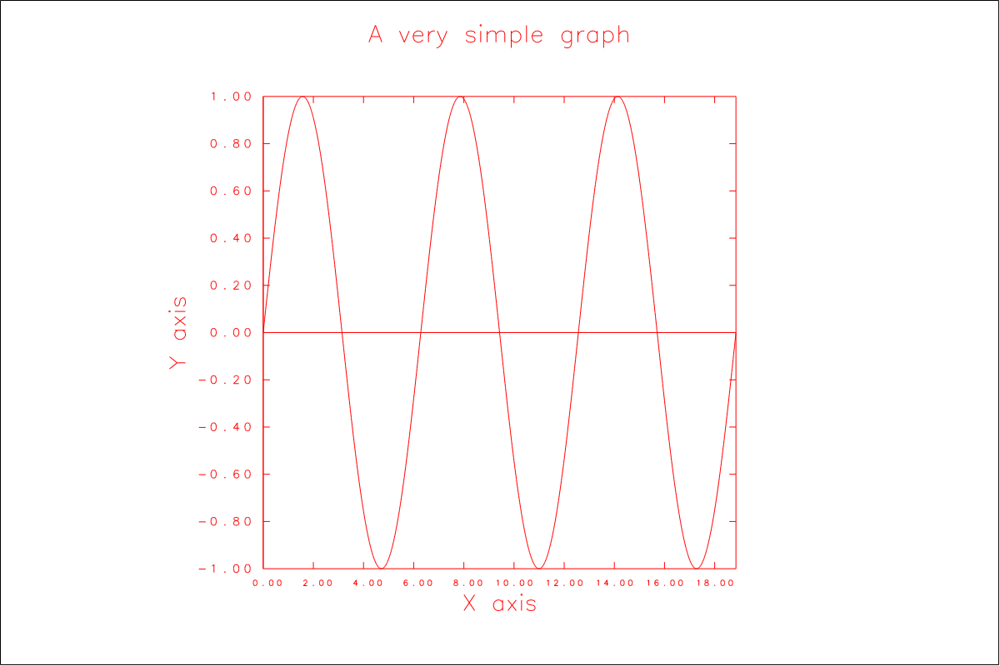

The script file (obey file) to generate this contains:
```
# SIMPLEST GRAPH
#
RESET
MEMTEST
TITLE "A*L VERY SIMPLE GRAPH"
XLABEL "X*L AXIS"
YLABEL "Y*L AXIS"
XYLINE
```

Although very minimal, there are a few points worth noting.

- For maximum NOS / "Unix" compatibility, it is best to use only UPPER CASE in obey files.
If you use lower case, it will work on both systems, but the results may be different. 
NOS (in `NORMAL` mode) will internally convert lower case to upper case. 
So "A very simple graph" will appear exactly as that on "Unix", but as "A VERY SIMPLE GRAPH" on NOS. 
Using upper case and DIMFILM "string markup" is portable and handles subscripts, superscripts, 
fractions and so on too. Note that GPLOT should *not* be used in `ASCII` mode on NOS! 
GPLOT does not attempt to deal with 6/12 Display Code, but will convert it (mostly!) to upper case. 
However, internal arrays are not sized for 6/12 representations, so there will be problems 
(mainly strings being unexpectedly truncated rather than crahses, though).
- The `RESET` command re-establishes a default state. If multiple obey files are used in one GPLOT session
without using `RESET` at the top of each file, the results will be unpredictable (the state 
at the end on one obey file will be inherited by the next).
- This script is device independent. It can be used "as is" with any of the supported devices. 
To generate SVG from it, we can use:
```
/ GPLOT or $ UGPLOT
? dev svg sveg 1200,800
? prefix obey-files
? obey obgraf1
? ex
```
which will create an SVG file called `sveg001` (`sveg001.svg` on "Unix") using a 
"resolution" of 1200 by 800 pixels (with SVG, this is
really a "size" rather than a resolution, as the vector data can be scaled without losing detail). 

- The various annotations associated with a graph (title, axis labels, etc.) should appear before the command which plots the data
(`XYLINE` here).
- The ranges of the X and Y axes are automatically determined from the supplied data.
- The graph is drawn in a square area in the center of the output device "canvas". 
When plotting graphs, it is often better to fill the output canvas.
- Everything is drawn in a single colour (red).

We will address these last two deficiencies in the next example.

### Bounds, panes, devices and coordinate systems in DIMFILM

It is perhaps worth understanding why the graph appears in a centered square area on the device
even at this stage.

DIMFILM lets the user define a "world coordinate system" or "user coordinates". These "bounds"
are defined by four numbers, `xlo` to `xhi` defining a range of X coordinates, and
`ylo` to `yhi` defining a range of Y coordinates. This coordinate system is intended to be "square"
in that a unit step in X should have the same length when drawn by the output device
as a unit step in Y. The output devices each have their own ranges of valid coordinates. In the 
case of the interactive devices (GTerm and the Tektronix 4014), these ranges are fixed (not strictly
true for GTerm). The valid range of coordinates can be set by the user for the "file" devices, 
SVG and EPS, by defining the "paper size" when the device is opened. The coordinate systems of these
devices are also defined to be "square".

DIMFILM also has the concept of a "pane", which is initially identical to the "bounds". The "pane"
is a rectangular subregion of the bounds, specified by four numbers in bounds coordinates.

For general purpose drawing, you want to have a "square" coordinate system, so that circles 
when drawn are circles and not ellipses.

For plotting graphs of data, though, "squareness" is not usually important. DIMFILM determines the
locations and sizes of the various elements of a graph in terms of fractions of the pane. The graph
will be placed inside the pane, squashed and stretched as may be to fill it.

The default initial bounds (and pane) are set to 0 to 1 by 0 to 1, which is a square region. To maintain
"squareness" while maximising the use of the display area, the bounds region must cover either the
height or the width of the display (or both).

To make the situation clearer, we can draw the limits of the device (which we have set to a 1200 by
800 "pixel" region when we opened the SVG device) and the outline of the bounds (and pane) region by adding
these commands:
```
OUTLINE DEVICE
OUTLINE BOUNDS
```


The only way to use the full area of the display is for the bounds to have the same *aspect ratio* as
the display. That is:

```
xhi - xlo     width_display
---------  =  -------------
yhi - ylo     height_display
```

### NOS, Unix-like systems and compatibility

Before moving on, it may be worth discussing how GPLOT tries to maximise compatability between
these two very different operating systems. 

Perhaps the most obvious thing when glancing at the first example is that the script is
entirely UPPER CASE. This need not be so, and the following will work on both "Unix-like"
systems and NOS (although after transfer to NOS without using 6/12 coding - which should
not be used - it will appear in upper case there).
```
# Simplest graph.
#
reset
memtest
title "A very simple graph"
xlabel "X axis"
ylabel "Y axis"
xyline
outline dev
```
On "Unix-like" systems, the output will be identical to the first script's output.
However, on NOS, the title and labels will appear in upper case.

Using DIMFILM's "string markup sequences" (the `*L` here) allows lower case to
be plotted on NOS. 

If you really don't like using upper case for some reason, you can use lower case
and "string markup" and get the same result as using upper case on both systems.

GPLOT also tries to use heuristics to make file name related matters transparent,
although there are limits to this considering each NOS account has a flat file
system with maximum 7 letter/digit upper case only file names!

For NOS / "Unix" compatibilty, you will have to stick to 7 character file names.
However, you can specify a path for "Unix" that is prefixed to each file name using
the `PREFIX` command. This prefix is not used for device output files, though, so they
will be created in the current working directory.

If you don't care about NOS compatibility, you can use long file names, so long as
the entire path name does not exceed 72 characters.

Note that NOS does not have file name extensions. In contrast, "Unix-like" 
systems pretty much rely on having file name extensions.  EPS output files
will be given `.eps` extensions on "Unix" and SVG files `.svg`. These should
not be added to the file names you type in or put in scripts.

To help identify what files contain on NOS, I use the first two characters as
a sort of "extension" -- e.g. `OB` for obey files -- but this is just a personal
convention which NOS knows nothing about.

GPLOT converts all supplied file names (including any `PREFIX`) to lower case
on "Unix". You cannot use upper or mixed case file names in GPLOT on "Unix".
This applies to all input and output files.
Very rarely, this will be undesirable, but it almost always simplifies matters.
On NOS, all file names are upper case and all lower case is converted to upper
case by NOS.

### Using different colours and filling the canvas
Here is the same graph as above, but with different classes of things in different
colours and filling the output canvas.


The code for this is:
```
# USING COLOUR/STYLE GROUPS
#
RESET
GRAPHMODE ON
MEMTEST
CSGROUP GENERAL
COL 1 0 0
CSG TEXT
COL 0 0 0
CSG ANNOT
COL 0 0.1 1
TITLE "A*L SIMPLE GRAPH WITH BETTER COLOURS"
XLABEL "X*L AXIS"
YLABEL "Y*L AXIS"
XYLINE
OUTLINE DEV
```

To use the full area of the device, the command:
```
GRAPHMODE ON
```
was added. This just sets the bounds to have the same aspect ratio
as the display device internally. In this case, to match the aspect ratio
of 1200 by 800 (3:2), the bounds will be set to 0 to 1.5 by 0 to 1.

Note that
```
GRAPHMODE OFF
```
resets the bounds to 0 to 1 by 0 to 1 and if bounds are explicitly specified,
they just supersede the ones set by `GRAPHMODE`.

In GPLOT/DIMFILM there are 3 "different classes of things", namely:

- Text (`TEXT`): this refers to all types of "strings".
- Annotation (`ANNOT`): this refers to the various things that annotate graphs specifically.
- Other (`GENERAL`): All elements not in the above classes. This includes all lines and points.

All of them are members of the class `ALL`.

These 3 classes are called "colour/style groups" and the current class is selected with the
    `CSGROUP` command. Following this, `COLOUR` and `WIDTH` commands set the colour (as normalised RGB)
and line width for that `CSGROUP` only. Perhaps oddly, the line style (solid, dashed, etc.) is *not* set
independently for different groups. The current line style applies to all groups.

Note that any command can be abbreviated -- so long as the abbreviation remains unique, it will work.
(Note that this is *not* true of evaluator operators, as we will see).

### Adding a grid or graticule
In order to better see the values on plotted graphs, it is often useful to have a grid
or graticule over which the graphs are plotted (as with traditional graph paper). This is
easily added with the `GRID` command:
```
# ADD A GRID
#
RESET
GRAPHMODE ON
MEMTEST
CSGROUP GENERAL
COL 1 0 0
CSG TEXT
COL 0 0 0
CSG ANNOT
COL 0 0.1 1
TITLE "A*L SIMPLE GRAPH WITH A GRID"
XLABEL "X*L AXIS"
YLABEL "Y*L AXIS"
GRID BOTH
XYLINE
OUTLINE DEV
```

resulting in:

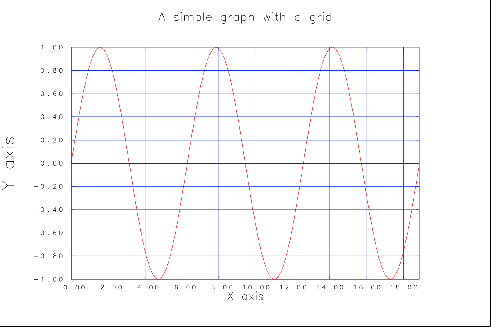

### Changing the width of lines
As with colour, the width of lines can easily be set independently for each colour/style
group with the `WIDTH` command.


```
# GRAPH PLOT WITH WIDER LINE
#
RESET
MEMTEST
GRAPHMODE ON
CSGROUP GENERAL
COL 1 0 0
WIDTH 3
CSG TEXT
COL 0 0 0
CSG ANNOT
COL 0 0.1 1
TITLE "A*L SIMPLE GRAPH WITH A WIDER LINE"
XLABEL "X*L AXIS"
YLABEL "Y*L AXIS"
GRID BOTH
XYLINE
OUTLINE DEV
```

### Different graph styles
The graphs above are all drawn with the default "framed" graph style. An alternative
is the "open" style:


```
# OPEN STYLE GRAPH
#
RESET
MEMTEST
GRAPHMODE ON
CSGROUP GENERAL
COL 1 0 0
WIDTH 3
CSG TEXT
COL 0 0 0
CSG ANNOT
COL 0 0.1 1
GSTYLE OPEN
TITLE "A*LN OPEN STYLE SIMPLE GRAPH"
XLABEL "X*L AXIS"
YLABEL "Y*L AXIS"
XYLINE
OUTLINE DEV
```

Another alternative is the "axes" style:

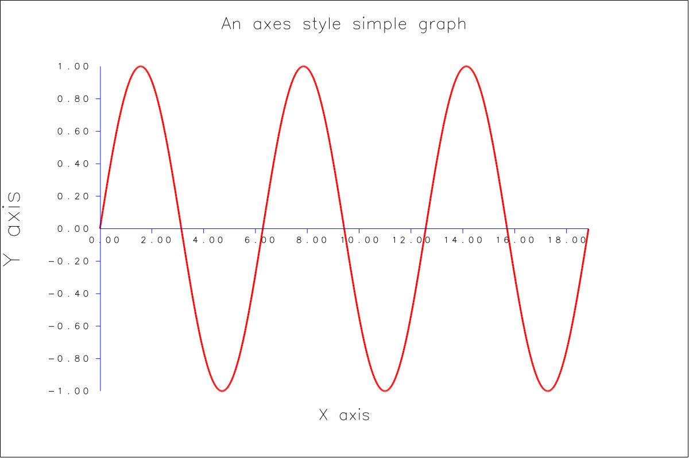

```
# AXES STYLE GRAPH
#
RESET
MEMTEST
CSGROUP GENERAL
COL 1 0 0
WIDTH 3
CSG TEXT
COL 0 0 0
CSG ANNOT
COL 0 0.1 1
AXCUT 0.02 0
GSTYLE AXES
TITLE "A*LN AXES STYLE SIMPLE GRAPH"
XLABEL "X*L AXIS"
YLABEL "Y*L AXIS"
XYLINE
OUTLINE DEV
```

To which a grid can be added in the obvious way:


```
# AXES STYLE GRAPH WITH GRID
#
RESET
GRAPHMODE ON
MEMTEST
CSGROUP GENERAL
COL 1 0 0
WIDTH 3
CSG TEXT
COL 0 0 0
CSG ANNOT
COL 0 0.1 1
AXCUT 0.02 0
GSTYLE AXES
GRID BOTH
TITLE "A*LN AXES STYLE SIMPLE GRAPH WITH GRID"
XLABEL "X*L AXIS"
YLABEL "Y*L AXIS"
XYLINE
OUTLINE DEV
```

### Multiple graphs on the same axes and "HERE" data

To plot more than one graph on the same axes is quite straightforward.
First, note that we haven't explicitly specified the ranges of the axes
in any of the graphs so far. Instead, the system has looked at the data
and automatically found reasonable ranges for the axes. This is very
often the best approach. 

To plot more than one graph and keep automatically determining the axis ranges
can be done with the with two commands: `XYSAME` and `ANNOT OFF`. The second
prevents annotation being drawn multiple times and the first keeps the axis
ranges automatically determined from the first data plotted.

GPLOT also lets you specify data "inline" in a script file. Here is a
very simple example and the script that generated it.


```
# 2 CURVE GRAPH WITH INLINE DATA
#
RESET
#
GRAPHMODE ON
GSTYLE BOXED
#
CSGROUP GENERAL
COL 1 0 0
WIDTH 1
STYLE SOLID
#
CSG TEXT
COL 0 0 0
STYLE SOLID
#
CSG ANNOT
COL 0 0.1 1
STYLE SOLID
#
#--- DEFINE SOME DATA INLINE 
READ HERE 1 2
0 0
1 1
2 0
EOF
#--- DRAW THAT WITH AUTO DETERMINED AXIS RANGES
GRID BOTH
TITLE "T*LWO CURVES, SAME AXES, INLINE DATA"
XLABEL "X*L AXIS"
YLABEL "Y*L AXIS"
XYLINE
#
#--- TURN OFF ANNOTATION AND KEEP AUTO DET RANGES FOR NEXT CURVE
ANNOT OFF 
XYSAME
#
#--- DEFINE SOME MORE DATA INLINE
READ HERE 1 2
0 1
1 0.1333
2 1
EOF
#
#--- DRAW THAT IN A DIFFERENT COLOUR AND WIDTH.
CSG GEN
COL 1 0 1
WIDTH 3
STYLE DASHDOT
XYLINE
OUTLINE DEVICE
```

Note the `READ` command. This is described further in the section on plotting
data in files. For inline data, the keyword `HERE` is used with it, and the data
follows immediately. That data is terminated by `EOF`. The numeric arguments
to `READ` are "column numbers" and will almost always be `1 2` for inline data.

### Multiple graphs and keys

GPLOT provides a straightforward (if inflexible) way of adding a key or legend to
help identify the meaning of the lines (or points) on graphs.

Here is an example of three curves with a key and the generating script. The
data is again defined by "HERE" data.

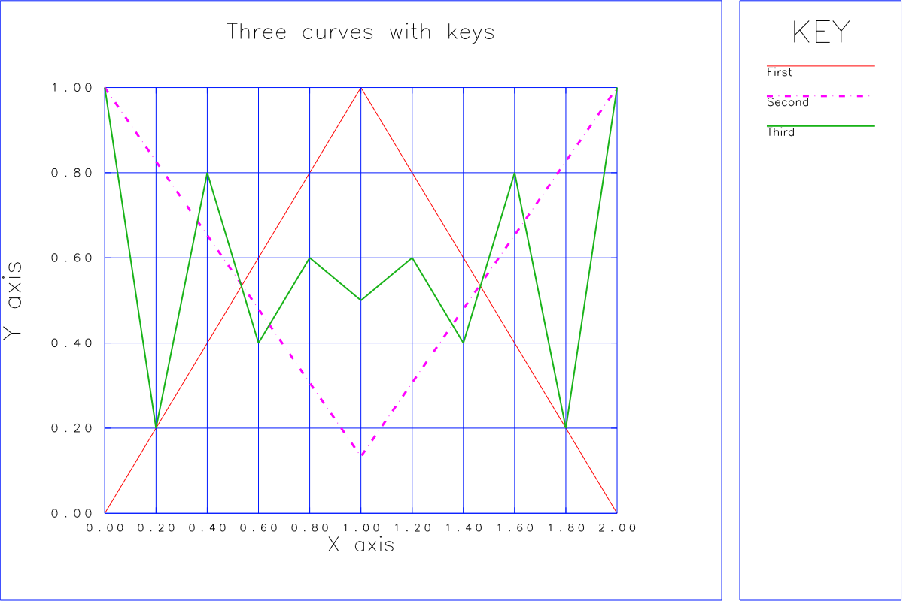

```
# 3 CURVE GRAPH WITH INLINE DATA AND KEYS
#
RESET
GRAPHMODE ON
#
GSTYLE BOXED
#
CSGROUP GENERAL
COL 1 0 0
WIDTH 1
STYLE SOLID
#
CSG TEXT
COL 0 0 0
STYLE SOLID
#
CSG ANNOT
COL 0 0.1 1
STYLE SOLID
#
# --- DEFINE SOME DATA INLINE 
READ HERE 1 2
0 0
1 1
2 0
EOF
#
# --- WE WILL ADD KEYS.
USEKEY
#
# --- DRAW THAT WITH AUTO DETERMINED AXIS RANGES
GRID BOTH
TITLE "T*LHREE CURVES WITH KEYS"
XLABEL "X*L AXIS"
YLABEL "Y*L AXIS"
XYLINE
ADDKEY "F*LIRST"
#
# --- TURN OFF ANNOTATION AND KEEP AUTO DET RANGES FOR NEXT CURVE
ANNOT OFF 
XYSAME
#
# --- DEFINE SOME MORE DATA INLINE
READ HERE 1 2
0 1
1 0.1333
2 1
EOF
#
# --- DRAW THAT IN A DIFFERENT COLOUR AND WIDTH.
CSG GEN
COL 1 0 1
WIDTH 3
STYLE DASHDOT
XYLINE
ADDKEY "S*LECOND"
#
# --- DEFINE YET MORE DATA INLINE
READ HERE 1 2
0 1
0.2 0.2
0.4 0.8
0.6 0.4
0.8 0.6
1.0 0.5
1.2 0.6
1.4 0.4
1.6 0.8
1.8 0.2
2 1
EOF
#
# --- DRAW THAT IN A DIFFERENT COLOUR AND WIDTH.
CSG GEN
COL 0.1 0.7 0.1
WIDTH 2
STYLE SOLID
XYLINE
ADDKEY "T*LHIRD"
#
# --- DRAW THE LEGEND.
KEYS
OUTLINE DEV
```

This allows adding keys for up to 20 curves (I find 10 curves on one graph is as
much as I can cope with). The maximum length of the key text is also quite limited
at a maximum of 15 characters (including any markup sequences).

The layout currently cannot be changed. The key/legend area is always positioned to
the right of the graph. This may be better than trying to put the key on top of the
graph, as it can be impossible to find a place to put that without obscuring part
of the data (at least, I've often found that is the case over the decades).  That
approach could certainly be added, though.

### Multiple curves with two different Y axis ranges

Sometimes it is useful to plot two (or more) curves with the same X axis but, because
they have significantly different Y ranges, two distinct Y axes. This can be done by
having one Y axis on the left of a graph and another on the right.

A simple example is:


```
# TWO CURVES, DIFFERENT AXIS RANGES
#
RESET
GRAPHMODE ON
CSG ANNOT
COL 0 0 1
CSG TEXT
COL 0 0 1
#
# --- GENERATE A SINE WAVE.
EVAL 0.1,TWPI,2,*,0.1,+,201,XLIN,X,SIN
#
# --- PLOT IT WITH AUTO AXIS RANGES.
XLAB "X"
YLABEL "S*LINE VALUE"
TITLE "T*LWO CURVES, DIFFERENT Y AXIS RANGES"
XYL
ANNOT OFF
#
# --- DEFINE A TRIANGLE WAVE SHAPE.
READ HERE 1 2
0 0
5 100
10 0
EOF
#
# --- PLOT THAT WITH AUTO AXIS, PUT VALUES ON RIGHT
CSG ALL
COLOUR 0 0 0
RIGHTANNOT ON
RYLABEL "R*LIGHT EDGE (TRIANGLE VALUES)"
XYL
OUTLINE DEV
```

This example includes the first use of the evaluator so far (to create the
sine wave curve). It is not essential to this example, though.

Note that the axis ranges are still automatically determined (`XYSAME` is
not used for obvious reasons). The `ANNOT OFF` command is need though,
before the `RIGHTANNOT` command is used.

It is possible to create a key for such a graph too:


```
# TWO CURVES, DIFFERENT AXIS RANGES, KEY
#
RESET
GRAPHMODE ON
CSG ANNOT
COL 0 0 1
CSG TEXT
COL 0 0 1
#
# --- GENERATE A SINE WAVE.
EVAL 0.1,TWPI,2,*,0.1,+,201,XLIN,X,SIN
#
# --- WE WILL USE KEYS.
USEKEY
#
# --- PLOT IT WITH AUTO AXIS RANGES.
XLAB "X"
YLABEL "S*LINE VALUE"
TITLE "T*LWO CURVES, DIFFERENT Y AXIS RANGES"
XYL
ADDKEY "S*LINE"
ANNOT OFF
#
# --- DEFINE A TRIANGLE WAVE SHAPE.
READ HERE 1 2
0 0
5 100
10 0
EOF
#
# --- PLOT THAT WITH AUTO AXIS, PUT VALUES ON RIGHT
CSG ALL
COLOUR 0 0 0
RIGHTANNOT ON
RYLABEL "R*LIGHT EDGE (TRIANGLE VALUES)"
XYL
ADDKEY "T*LRIANGLE"
#
# --- DRAW LEGEND.
KEYS
OUTLINE DEV
```

### Plotting data stored in a disk file

So far, we have plotted data that has been generated by GPLOT or stored as
"HERE" data in the command stream. Very often, the data to be plotted will be
in disk files, though.

GPLOT provides a very simple, albeit basic, way of reading such data and plotting
it. Given a file containing the same number of numeric items on each line,
with those items separated by spaces or a comma (and perhaps spaces), GPLOT
can treat the n-th number on each line as an entry in a column of numbers.
The columns are numbered 1, 2, 3, etc.

Any line that begins with `#` or `C` (upper case C, not lower case) will be
skipped as a comment. Any entirely blank lines will also be skipped.

The `READ` command is followed by the name of the data file to be read
then the column numbers for the X and Y coordinates.

Here is an example of some real measured data stored in a file (`DAEG1`)
and plotted:


```
# READ AN X,Y DATA FILE AND PLOT THE CONTENTS
#
RESET
GRAPHMODE ON
#
# --- READ THE DATA FILE, FIRST 2 COLUMNS, SPACE OR COMMA SEP.
GET DAEG1
READ DAEG1 1 2
#
# --- DRAW THE GRAPH
CSG ANNOT
COL 0 0 0
CSG TEXT
COL 0 0 0
TITLE "M*LAINS VOLTAGE ON 7-*UAUG*L-2025"
XLABEL "H*LOURS W.R.T MIDNIGHT 6/7 *UA*LUGUST"
YLABEL "V*LOLTS (*URMS - 220V *LNOMINAL)"
XYLINE
#
OUTLINE DEV
```

The data file will usually have at least two columns. However, a single
column of data can be plotted. That data will become the Y values and the
X values will be the line number (starting at 0). Use a 0 column number
to do this. For example:
```
READ DAEG1 0 2
```

### Labelling points on a graph

It is sometimes useful to point out something on a graph. Here is
an example:


This is quite easy to do, in this case by adding the following commands between
`XYLINE` and `OUTLINE`:

```
#
# --- ADD A LABEL OR TWO
CSG ALL
COL 0 0 0
GLABEL 9.8 192.0 0.1 165 "W*LHAT HAPPENED?"
CSG TEXT
COL 0.7 0.384 0.025
GLABEL 14 191.5 0.05 165 "E*LEK"
```

The `GLABEL` command's first two arguments are the graph coordinates
to which the label's arrow should point. The third argument is the
length of the arrow in *bounds coordinates* (which will be 0 to 1 by
0 to 1 by default, or 0 to (device aspect ratio) by 0 to 1 if
`GRAPHMODE ON` is in effect). The fourth argument is the angle
of the arrow around the location it is pointing at, counter-clockwise
from `+X` in degrees. The final argument is the text for the label,
which will be drawn in a box at the blunt end of the arrow.

### Data with uncertainties (error bars) in Y

If your data has an uncertainty measure associated with it, that can
be plotted as an error bar on the graph. The meaning of this value is
entirely up to you, of course. For common meanings see this
[Wikipedia article](https://en.wikipedia.org/wiki/Error_bar).

Using a concocted data file (`DAEG2`) which looks like this:
```
0.0,0.0,0.0
0.1,0.01,0.004
0.2,0.04,0.01
0.3,0.09,0.041
0.4,0.16,0.083
0.5,0.25,0.013
0.6,0.36,0.022
0.7,0.49,0.033
0.8,0.64,0.054
0.9,0.81,0.065
1.0,1.0,0.1
```
(note the use of comma separated instead of blank separated values here),
the following script will plot a graph with error bar data taken from
column 3:
```
# READ AN X,Y,E DATA FILE AND PLOT THE CONTENTS
#
RESET
GRAPHMODE ON
#
# --- READ THE DATA FILE, FIRST 3 COLUMNS. THIS ONE USES COMMAS.
GET DAEG2
READ DAEG2 1 2 3
#
# --- DRAW THE GRAPH
CSG ANNOT
COL 0 0 0
CSG TEXT
COL 0 0 0
CSG GEN
COL 0.8 0.1 0.1
TITLE "L*LOOKS LIKE X*+2$+ WITH SYMMETRICAL ERRORS"
XLABEL "X"
YLABEL "Y"
XYLINE
OUTLINE DEV
```


The column given as the third argument to `READ` supplies the delta from the
values taken from the column given as the second argument to `READ` at which
error bar limits will be drawn above and below the value.

### Data with asymmetric uncertainties in Y

It is possible that your data has potential deviations that are larger
in the negative direction than in the positive direction, perhaps because
the underlying data distribution is not normal, but skewed, or perhaps the
device making measurements has errors that are proportional to the magnitude
of the measured values. To visualise this, you need asymmetric error bars in Y.

To illustrate this, we have concocted another data file (`DAEG3`):
```
0.0,0.0,0.0,0.0,0.0
0.1,0.01,0.004,0.006,0.002
0.2,0.04,0.01,0.12,0.033
0.3,0.09,0.041,0.032,0.092
0.4,0.16,0.083,0.043,0.161
0.5,0.25,0.013,0.09,0.251
0.6,0.36,0.022,0.022,0.3617
0.7,0.49,0.033,0.021,0.5
0.8,0.64,0.054,0.066,0.666
0.9,0.81,0.065,0.032,0.814
1.0,1.0,0.1,0.05,0.997
```
Note this has 5 columns but here we will use the first four.

To plot this with asymmetrical error bars only requires a
change to `READ`. The `XYLINE` (or `XYPOINT`) command will plot
whatever the last `READ` has read.

Note the command: `ASYMYERRORS YES` which explicitly turns on this
behaviour. This is not needed, however, as it is the default.
```
# READ AN X,Y,EU,EL DATA FILE AND PLOT THE CONTENTS
#
RESET
GRAPHMODE ON
#
# --- READ THE DATA FILE, FIRST 4 COLUMNS. THIS ONE USES COMMAS.
ASYMYERRORS YES
GET DAEG3
READ DAEG3 1 2 3 4
#
# --- DRAW THE GRAPH
CSG ANNOT
COL 0 0 0
CSG TEXT
COL 0 0 0
CSG GEN
COL 0.8 0.1 0.1
TITLE "L*LOOKS LIKE X*+2$+ WITH ASYMMETRICAL ERRORS"
XLABEL "X"
YLABEL "Y"
XYLINE
OUTLINE DEV
```

This results in:


Note that the column specified as the 3rd argument to `READ` is the
delta from the 2nd argument column value to the *upper* limit of the 
error bar, and the column specified as the 4th argument is the (negative)
delta to the *lower* limit of the error bar.

It is easy to plot points on top of this. This might be useful when the
points are derived from real measurements and a curve has been fitted
to these measurements. As an example of this, we take the point Y
coordinates from the 5th column of `DAEG3` using this script:
```
# READ AN X,Y,EU,EL DATA FILE AND PLOT THE CONTENTS
#
RESET
GRAPHMODE ON
#
# --- READ THE DATA FILE, FIRST 3 COLUMNS. THIS ONE USES COMMAS.
ASYMYERRORS YES
GET DAEG3
READ DAEG3 1 2 3 4
#
# --- DRAW THE GRAPH
CSG ANNOT
COL 0 0 0
CSG TEXT
COL 0 0 0
CSG GEN
COL 0.8 0.1 0.1
TITLE "*LX*+2$+ WITH ASYMMETRICAL ERRORS AND POINTS"
XLABEL "X"
YLABEL "Y"
XYLINE
#
# --- PLOT POINTS
XYSAME
ANNOT OFF
CSG GEN
COL 0 0 1
SYMHT 0.04
READ DAEG3 1 5
XYPOINT
#
OUTLINE DEV
```


### Data with symmetric uncertainties in Y and X

It is also easy to plot data with uncertainty estimates in both axes.
This requires the same 4 data columns as used above, but with the
command:
```
ASYMYERRORS NO
```
Note that this *must* appear *before* the `READ` command, as it causes data to
be rearranged internally immediately after it is read. In this case, the 3rd
column is interpreted as symmetric Y error and the 4th as symmetric X error.


### Interpolating the data points

The supplied data can be interpolated for the purposes of plotting "smooth" curves
through, rather than straight lines between, the supplied data. This is generally
frowned upon in science, but GPLOT/DIMFILM can do it!

In addition to `LINEAR` interpolation (which is usually pointless, as the appearance
of the graph does not change), a cubic (3rd order) or quintic (5th order) polynomial
can be drawn through the data points. At least 3 points must be supplied for cubic,
and 5 for quintic, interpolation. The data must be sorted in X. The number of points 
to be found between each supplied point must be specified. If the data is not
reasonably "well behaved", there can be numerical issues.

To demonstrate this capability, here is a very simple example:


This is created by the following script:
```
# INTERPOLATION
#
RESET
GRAPHMODE ON
#
# --- SOME DATA - VERY UNDERSAMPLED SIN(X)
READ HERE 1 2
0.00000  0.00000
0.78540  0.70711
1.57080  1.00000
2.35619  0.70711
3.14159  0.00000
3.92699 -0.70711
4.71239 -1.00000
5.49779 -0.70711
6.28319  0.00000
EOF
#
# --- SETUP THE GRAPH
USEKEY
CSG ANNOT
COL 0 0 0
CSG TEXT
COL 0 0 0
CSG GEN
COL 0.8 0.1 0.1
YRANGE -1.2 1.2
TITLE "I*LNTERPOLATIONS"
XLABEL "X"
YLABEL "Y"
#
# --- LINEAR INTERPOLATION, 9 INTERMEDIATES.
INTERPOLATE LINEAR 9
XYLINE
ADDKEY "L*LINEAR"
#
# --- POINTS BEING INTERPOLATED.
XYSAME
MARKER 20
XYPOINT
#
# --- CUBIC
COL 0.1 0.8 0.1
INTERPOLATE CUBIC 9
XYLINE
ADDKEY "C*LUBIC"
#
# --- QUINTIC
COL 0.1 0.1 0.8
INTERPOLATE QUINTIC 9
XYLINE
ADDKEY "Q*LUINTIC"
#
# --- FINISH THE GRAPH
KEYS
```

### Log Linear Plots

It is possible to use a logarithmic Y axis and linear X axis. An
example of this is:


Well, if we were hoping for a straight line with log Y for this function,
we are going to be disappointed! Here is the script fot this:

```
# LOG Y AXIS
#
RESET
GRAPHMODE ON
CSG ANNOT
COL 0 0 1
CSG TEXT
COL 0 0 1
#
# --- SQUARES OF SOME NUMBERS.
READ HERE 1 2
1 1
2 4
3 9
4 16
5 25
6 36
7 49
8 64
9 81
10 100
EOF
#
# --- WE WILL USE KEYS.
USEKEY
#
# --- PLOT IT WITH LOG Y AXIS
XLAB "*LX"
YLABEL "*LLOG(Y)"
TITLE "*LY=X*+2$+ WITH LOG Y AXIS"
GRID BOTH
YLOG
XYLINE
ADDKEY "L*LOG"
ANNOT OFF
#
# --- PLOT IT WITH LINEAR Y AXIS, VALUES ON RIGHT
CSG ALL
COLOUR 0 0 0
RIGHTANNOT ON
RYLABEL "Y (L*LINEAR)"
YLIN
XYL
ADDKEY "L*LINEAR"
#
# --- DRAW LEGEND.
KEYS
#
# OUTLINE DEV
```

Let's try a power function instead:


Ah hah! This time we are in luck -- a straight line using a log-linear plot!

### Log Log Plots

It is also easy to plot data with both log Y and log X axes. This script
will do that with the same data as shown in the first log-linear plot (but
with the values scaled up to see what happens):

```
# LOG X AND Y AXIS
#
RESET
GRAPHMODE ON
#
CSG ANNOT
COL 0 0 1
CSG TEXT
COL 0 0 1
#
# --- SQUARES OF SOME NUMBERS.
READ HERE 1 2
1.0E7 1
2.0E7 4
3.0E7 9
4.0E7 16
5.0E7 25
6.0E7 36
7.0E7 49
8.0E7 64
9.0E7 81
1.0E8 100
2.0E8 400
3.0E8 900
4.0E8 1600
5.0E8 2500
6.0E8 3600
7.0E8 4900
8.0E8 6400
9.0E8 8100
1.0E9 10000
EOF
#
# --- WE WILL USE KEYS.
USEKEY
#
# --- PLOT IT WITH LOG X AND Y AXES
XLAB "*LLOG(X)"
YLABEL "*LLOG(Y)"
TITLE "*LY=(*,X$,10*+7$+$.)*O*+2$+$* WITH LOG X AND Y AXES"
GRID BOTH
XLOG
YLOG
XYLINE
ADDKEY "L*LOG"
#
# --- PLOT IT WITH LINEAR Y AXIS, VALUES ON RIGHT
ANNOT OFF
CSG ALL
COLOUR 0 0 0
RIGHTANNOT ON
RYLABEL "Y (L*LINEAR)"
YLIN
XYL
ADDKEY "L*LINEAR"
#
# --- DRAW LEGEND.
KEYS
```

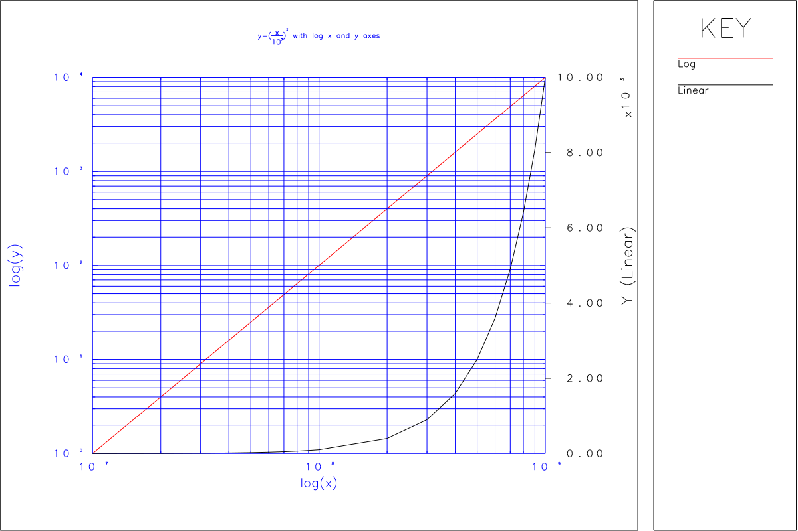

And we now have a straight line on the log-log plot for this function.

Note that one of the main reasons people plot experimental data with
log-linear or log-log axes is in the hope of seeing something like a 
straight line when they do so, which gives them a clue to the form of
a mathematical model which might "explain" the experimental data (or,
at least, approximate it).


### Histograms and multiple plots in one figure

Histograms are another common type of plot and GPLOT can draw them in
various styles. There are no facilities for binning raw data so that
histograms can be drawn, however. Other software must prepare counts
of data points that fall into bins of specified ranges. All GPLOT
deals with are the counts and bin numbers for each count. 

As a minimal example, here is a single column of counts that can be
represented by a histogram (file `DAEG4`):
```
100
123
90
20
10
1
200
233
129
43
77
6
2
9
64
99
12
18
111
87
```

The following script draws histogram plots of this data in four
different styles:
```
# READ A COUNTS ONLY DATA FILE AND MAKE HISTOGRAMS.
#
RESET
#
# --- READ THE DATA FILE, FIRST COLUMN ONLY.
GET DAEG4
READ DAEG4 0 1
#
# --- SET COLOURS
CSG ANNOT
COL 0 0 0
CSG TEXT
COL 0 0 0
CSG GEN
COL 0.8 0.1 0.1
#
# --- SET THE AXIS RANGES AND USE INT LABELS.
XRANGE -1 20
YRANGE 0 240
AXCUT NO
INTVALUES BOTH
#
# --- SET AXIS LABELS.
XLABEL "C*LLASS NUMBER"
YLABEL "C*LOUNT"
#
# --- ABUT STYLE IN BOTTOM LEFT.
PANE 0 0.5 0 0.5
HISTSTYLE ABUT
TITLE "C*LOUNTS HISTOGRAM (ABUTTING BARS)"
XYHIST
OUTLINE PANE
#
# --- SHADED ABUT STYLE IN BOTTOM RIGHT.
PANE 0.5 1 0 0.5
HISTSTYLE ABUT+SHADE
TITLE "C*LOUNTS HISTOGRAM (ABUTTING SHADED BARS)"
XYHIST
OUTLINE PANE
#
# --- SPECIFIED WIDTH BARS IN TOP LEFT.
PANE 0 0.5 0.5 1
HISTSTYLE WIDE 0.25
TITLE "C*LOUNTS HISTOGRAM (SPECIFIED WIDTH BARS)"
XYHIST
OUTLINE PANE
#
# --- THIN LINES IN TOP RIGHT.
PANE 0.5 1 0.5 1
HISTSTYLE LINES
TITLE "C*LOUNTS HISTOGRAM (IMPULSES)"
XYHIST
OUTLINE PANE
#
OUTLINE DEV
```


In addition to showing how to draw histogram plots, this example shows
a number of other new features.

- We explicitly specify X and Y axis ranges rather than letting the software choose. This
  is done with the `XRANGE` and `YRANGE` commands.
- We prevent lines being drawn for the axes -- vertical and horizontal lines that pass through
  (0,0) (or another point specified with `AXCUT`) -- by using: `AXCUT NO`
- We try to use integers for the axis values instead of floating point numbers using
  `INTVALUES BOTH`. This option can be requested for X, Y, both or neither axis. It may
  not always be honoured, as it will be impossible for many axis ranges. But in this case,
  it is a reasonable request and it works.
  
The most obvious new feature, though, is that the four plots showing the different histogram
drawing styles appear in a single "figure".

This can be done easily with DIMFILM, as graphs are plotted inside any specified "pane"
(see above), so all you have to do is use `PANE` appropriately.

Actually, though, that needs some (trivial) manual calculation, but it may also need to account
for the device aspect ratio if the output canvas is to be filled. To further simplify creating
multiple plots in a single "figure", GPLOT has the `SUBFIGGRID` command (which can be abbreviated,
fortunately). This lets you specify a rectangular arrangement of "sub-figures" and the current
sub-figure to be drawn (before any plotting commands) and calculates an appropriate pane for
you, accounting for the device's aspect ratio (if `GRAPHMODE ON` has been used). 
It also lets you "shrink" the figure, so there is some white space between it and its neighbours.

An example of using this is:


The script for that is very similar to the one above, but with these changes:
```
# READ A COUNTS ONLY DATA FILE AND MAKE HISTOGRAMS.
#
RESET
GRAPHMODE ON
...
#
# --- ABUT STYLE IN BOTTOM LEFT.
SUBFIG 2 2 1 1 0.95
HISTSTYLE ABUT
...
#
# --- SHADED ABUT STYLE IN BOTTOM RIGHT.
SUBFIG 2 2 2 1 0.95
HISTSTYLE ABUT+SHADE
...
#
# --- SPECIFIED WIDTH BARS IN TOP LEFT.
SUBFIG 2 2 1 2 0.95
HISTSTYLE WIDE 0.25
...
#
# --- THIN LINES IN TOP RIGHT.
SUBFIG 2 2 2 2 0.95
HISTSTYLE LINES
...
#
OUTLINE DEV
```


### Multiple plots with keys in one figure.

The "sub-figures" feature also works with graphs with keys (some juggling of
panes is involved internally). An example of this is:


This redraws four of the example plots shown above. Some minor changes to the
scripts that drew them were made (any `RESET`, `GRAPHMODE` or other commands
that changed the bounds or pane were removed). These modified versions are
stored in the script files `OBGF28A`, `OBGF28B`, `OBGF28C` and `OBGF28D`. These
are then "called" from a "master" script file `OBGF28M` (obey files can be
nested up to 5 levels deep):
```
# FOUR DISPARATE PLOTS, ONE FIGURE.
#
#===========================
RESET
GRAPHMODE ON
# --- BOTTOM LEFT OF 4
SUBFIG 2 2 1 1 0.98
#
OBEY OBGF28A
#===========================
RESET
GRAPHMODE ON
# --- TOP RIGHT OF 4
SUBFIG 2 2 2 2 0.98
#
OBEY OBGF28B
#
# ========================
RESET
GRAPHMODE ON
# --- TOP LEFT OF 4
SUBFIG 2 2 1 2 0.98
#
OBEY OBGF28C
# ========================
# --- BOTTOM RIGHT OF 4
RESET
GRAPHMODE ON
SUBFIG 2 2 2 1 0.98
#
OBEY OBGF28D
OUTLINE PANE
#
OUTLINE DEV
```

(Note that files will be stored on "Unix-like" systems with lower case file names
but may be referred to in upper case in GPLOT -- all file names are converted
internally to lower case by GPLOT on "Unix" before being accessed. These names
could appear in lower case -- as could all commands -- and it would work)

Please example the "called" scripts for more information.

When generating a multi-plot "figure", you must keep the grid size constant
in the `SUBFIG` command (e.g. `SUBFIG 2 2`) for every sub-figure. This is probably
obvious, but nothing can check for this.

Note the repetition of `RESET` and `GRAPHMODE ON` for each sub-figure. Without this,
the various colours and styles set in one sub-figure script would be inherited by the
next. These must occur *before* the `SUBFIG` command, so they cannot be left in the
script files.

### Using the RPN evaluator to plot simple functions

GPLOT includes a feature for calculating function values rather than reading
them from files. This is the Reverse Polish Notation (RPN) evaluator, which provides
features very similar to those you would find on classic HP calculators.

One difference is that the RPN evaluator often operates on *arrays* rather than
scalar values, in a way that might be familiar to people who have used NumPy or
an APL-like language, perhaps. But with RPN thrown in for extra confusion!

The evaluator has quite a few features beyond those needed for simple function
plotting, and its main limitation is perhaps that the "program" length is
limited by the 80 character input line limit (beyond which all input is truncated).

A complete description of the available operators can be found in the "cheat sheet"
below (which uses a notation familar to FORTH users) and in the PDF format GPLOT manual.
Here, we just give some examples as an introduction.

Admittedly, the RPN evaluator may not be all that easy to use (the `DUMP` operator is
helpful when debugging), but it opens up a lot of possibilities.

When dealing with data from files, GPLOT uses between 2 and 4 arrays to store the
data to be plotted. Two are used to store X and Y coordinates. If symmetric error
bars are to be plotted a third array is used to store that, and asymmetric Y error
bars or Y and X error bars use a fourth array.

The RPN evaluator treats these four arrays as the first four levels of a stack.
If `READ` is used, their contents will be overwritten by the read data and the
array length seen by the evaluator will be the number of points read. 

To provide "room" for any but the simplest calculations, another 4 stack levels
(arrays) are provided "above" to four used for data from `READ`. (This can be
configured with the `NSTACK` command).

It is possible to use the first two X and Y levels of the stack as inputs
to the evaluator. More often, though, the contents of the X array are set
to cover some range of values by the `ERANGE` command or certain evaluator
operators, and the evaluator sets the Y values in the Y array. This is
how it can fairly straightforwardly plot mathematical functions.

The evaluator "cheat sheet" below tries to show this stack of arrays
diagrammatically.

As a first, very simple, example, let's compute "y=x^2". In previous examples
the data has been precomputed and read from a file (often a "HERE" file). This
script generates the y values for a defined range of x values and plots the result
(left hand subfigure, below).
```
RESET
GRAPHMODE ON
#
CSG ANNOT
COL 0 0 0
CSG TEXT
COL 0 0 0
#
ERANGE 1 1 100 100
EVAL X,2,**
#
XLABEL "X"
YLABEL "Y"
TITLE "X*+2"
GRID BOTH
XYLINE
#
OUTLINE DEV
```


The two commands that generate the data to be plotted are `ERANGE` and
`EVAL`. The `ERANGE` command defines a range of x values for which the
function is the be evaluated. In the case given here, it is similar to the
NumPy "linspace" function. The first argument is the logarithm base, which, 
if 1, indicates we want to sample a linear range. The next two values are
the start and end x values, and the final argument is the number of steps
to take between start and end. `ERANGE` puts its output in the X array,
which is also stack level 0.

The RPN evaluator does not use the X array as a "normal" part of the stack.
It can be read via the `X` operator, which pushes its contents on the 
stack. The X array can be written to by the `SETX` operator. Otherwise,
it is not accessed.

The `EVAL` operator needs one argument (a second is optional) which is an
"RPN string" containing operators and operands for the evaluator to, er,
evaluate. It may be enclosed in double quotation marks. 

Whatever the evaluator leaves in the stack level 1 or Y array can be
plotted against the X array contents using `XYLINE` or the other graphing
commands.

To make the evaluator more useful, there are 9 "procedure registers"
which can contain "RPN strings". These can be executed by the evalautor
using the notation:
```
EVAL @1
EVAL @1,@3
```
which "calls" one or more procedure register contents (sequentially). The
contents of a "procedure register" can be set with the `PROC` command.
They can also be set with the `LOADPROC` command, which looks for a
named procedure in the file `GPLPROC` and loads it into a specified
"procedure register" if it is found.

Note that the GPLOT evaluator does not actually do a "call and return" when
it sees `EVAL @1`, etc. Instead, it uses string substitution to replace `@1`
with the string in procedure register 1. It does this repeatedly, if necessary,
until there are no remaining `@n` sequences in the substituted string.

There are also 9 *scalar* "memory" registers, which can be set with the
`STO` command and recalled with `RCL`. Often, parameters for procedures
are put into these registers with `STO` then accessed in the RPN with
the `RCL` or (as an abbreviation) `#`.

To make evaluating procedures with parameters more straightforward,
the optional second argument to `EVAL` is a comma separated list
of numeric values to `STO` into consecutive scalar registers (starting 
with the 1st) before running the RPN string. For example,
```
EVAL @1 "1,2,3,4"
```
would put 1 in scalar register 1, 2 in register 2, and so on, then "call" 
the procedure in "procedure register" 1.

Finally, there are 9 "string registers" which can be set with arbitrary
strings (maximum 80 characters) using the `STRING` command. These can then
be used in an RPN procedure for plotting text.

Returning to plotting simple functions, this script graphs a slightly
more complex function:
```
CSG ALL
COL 0 0 0
WIDTH 1
CSG GENERAL
COL 0 0 1
WIDTH 2
#
ERANGE 1 0 13 801
EVAL X,TWPI,*,SIN,X,PI,2,SQRT,*,*,SIN,+
#
XLABEL "*LX (ARGUMENT)"
YLABEL "*LY (NEVER REPEATS)"
TITLE "*LY=SIN(2 PI X) + SIN(2*+*,1$,2$.$+ PI X)"
XYL
```
This is plotted in the righthand sub-figure above.
This function is mathematically interesting, as it never
repeats (i.e. its period is infinite). This will not
be the case when it is plotted on a digital computer, though, as all 
numbers on such machines are rational, but the period will be
enormous.

### General drawing - Part 1: Basic functions

DIMFILM provides some basic drawing capabilities apart from its extensive
graph plotting functionality. Graph plotting is based on these lower
level capabilities, as you would expect.

There is a simple but sound foundation for general drawing with the 
`BOUNDS` command, which establishes a user defined coordinate system,
the `PANE` command, which sets up a rectangle in bounds coordinates
outside of which no drawing will occur (a "clip to inside" region) and
the `BLANK` command, which sets a rectangle inside 
of which no drawing will occur (a "clip to
outside" region). These commands map directly to DIMFILM subroutines.

For convenience, GPLOT adds a `CANVAS` command, which just sets the
bounds and the pane to the same coordinate ranges. 

All general purpose drawing uses the coordinates established by
`BOUNDS`. If no explicit `BOUNDS` command is given, this defaults
to 0 to 1 by 0 to 1, which will be a square region, centered in the
output device drawable rectangle. As noted above, to use the full area
of the output device, the aspect ratio of the bounds must match the
aspect ratio of the device. This can be done automatically for
graph plotting applications using `GRAPHMODE ON`, but you will generally
want to choose your own coordinate ranges for general drawing, often
bearing the device aspect ratio in mind when doing do.

The low level drawing operations available are `MOVE` to move the
"current position" to a specified coordinate, `DRAW` to draw from
the current postion to a new position (which becomes the current position)
in a straight line, `CIRCLE` which draw a circle of a given radius at
a given position, `ARC` which draws a segment of a circle, and `RECT` which
draws a rectangle.

Two GPLOT commands build slightly on this: `CRECT` draws a rectangle centered
on a given location and `PATH` uses the contents of the X and Y arrays
to draw a polyline. GPLOT/DIMFILM does not support the drawing of any
kinds of smooth curves for general drawing purposes (`INTERPOLATE` can
interpolate smooth curves between data points for graph plotting, but this
can't be used for general drawing).

DIMFILM has very limited geometric transformation support and GPLOT does
not provide access to this. GPLOT does provide a more comprehensive
geometric transformation capability through its RPN evaluator, though.

While these graphics facilities are fairly basic, there is also a rather
comprehensive set of facilities for drawing text using vector fonts. These
are accessed through the `TEXT` and `CTEXT` commands, with various properties
set by the `SYMHT`, `SYMANG` and `FONT` commands. The fonts are specific to
DIMFILM (there is no way to use any "system fonts"!) and are, in this
implementation, some of the Hershey fonts. The available fonts
can be listed with the `LISTFONT` command.

Special "marker" characters can also be drawn using the `MARKER` command
with the optional 2nd argument set to `YES`.

The text output facility allows
"markup" to be included in the string to draw, and this extends to sub-scripts,
super-scripts, and fractions, which can be nested to two levels. Mathematical
notation can, to a useful degree, be accommodated by this. Although we have
high quality font drawing everywhere now (and for the last few decades), when
DIMFILM was first released (1973), this was cutting edge. Mathematical notation 
is still not readily expressible everywhere it might be useful even today, in fact.

An example which shows most of the basic drawing operations in action is:

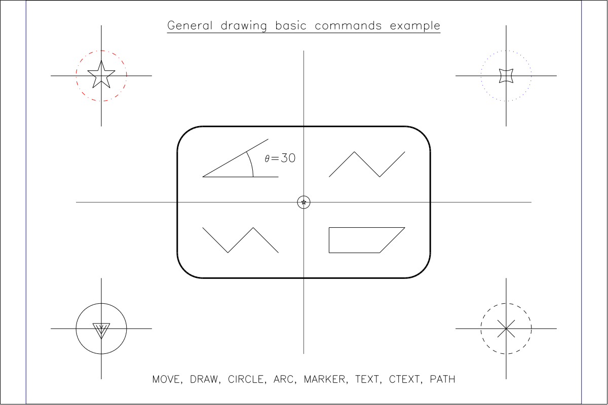

The script for this is a little long, but may be worth presenting in full:
```
RESET
CANVAS 0 22 0 16
#
CSG TEXT
COL 0 0 0
CSG GEN
COL 0 0 0
#
# DRAW CIRCLES
CIRCLE 3 3 1
STYLE DASH
CIRCLE 19 3 1
STYLE DOT
COL 0 0 1
CIRCLE 19 13 1
STYLE DASHDOT
COL 1 0 0
CIRCLE 3 13 1
STYLE SOLID
COL 0 0 0
#
# DRAW ANGLE
MOVE 7 9
DRAW 10 9
MOVE 7 9
DRAW 9.5981 10.5
ARC 7 9 2 0 30
MOVE 9.45 9.5
SYMHT 0.5
TEXT "*:83=30"
#
# DRAW CENTER CROSS + MARKERS
COL 1 0 0
MOVE 2 8
DRAW 20 8
MOVE 11 2
DRAW 11 14
MOVE 11 8
COL 0 0 0
MARKER 9 Y
MARKER 23 Y
#
# DRAW CIRCLE CROSSES AND MARKERS
MOVE 1 13
DRAW 5 13
MOVE 3 11
DRAW 3 15
SYMHT 3
MOVE 3 13
MARKER 9 Y
#
MOVE 17 13
DRAW 21 13
MOVE 19 11
DRAW 19 15
MOVE 19 13
MARKER 24 Y
#
MOVE 1 3
DRAW 5 3
MOVE 3 1
DRAW 3 5
MOVE 3 3
MARKER 13 Y
#
MOVE 17 3
DRAW 21 3
MOVE 19 1
DRAW 19 5
MOVE 19 3
MARKER 3 Y
#
# DRAW ROUND CORNER RECTANGLE
WIDTH 3
ARC 7 6 1 180 270
ARC 15 6 1 270 360
ARC 7 10 1 90 180
ARC 15 10 1 0 90
MOVE 6 6
DRAW 6 10
MOVE 16 6
DRAW 16 10
MOVE 7 5
DRAW 15 5
MOVE 15 11
DRAW 7 11
WIDTH 1
#
# ODDITIES
MOVE 7 7
DRAW 8 6
DRAW 9 7
DRAW 10 6
#
MOVE 12 9
DRAW 13 10
DRAW 14 9
DRAW 15 10
#
READ HERE 1 2
12 6
14 6
15 7
12 7
EOF
PATH C
#
SYMHT 0.5
MOVE 11 15
CTEXT 0 "*=G*LENERAL DRAWING BASIC COMMANDS EXAMPLE$="
MOVE 11 1
CTEXT 12 "MOVE, DRAW, CIRCLE, ARC, MARKER, TEXT, CTEXT, PATH"
#
CSG GEN
COL 0 0 1
OUTLINE BOUNDS
OUTLINE DEV
```
Most of this is likely to be self explanatory. The only points that
may be unclear are:

- The use of a "special character" from the symbol font (which is loaded
with `MATH.SMALL` by default) to draw the "theta" character. This is done by:
`TEXT "*:83=30"` where the "theta" is selected by character number (83) using
string markup. How do we know which character number to use? By looking at 
"font tables" which can be generated with one of the supplied script files
(`obfont` for "normal" alphabets, `obsyms` for symbols and `obmarks` for
markers). This is explained further in a later section (below).
- The `MARKER` command, which will draw a specified marker (which is 
determined by a number) at the current position *if* a second argument
(`YES` - abbreviated, any case) is supplied. If only one argument is supplied,
the `MARKER` command sets the marker number to use for points when plotting
graphs.
- Polyline paths can be drawn with the `PATH` command with coordinates
defined by a `HERE` file. This is quite a convenient way of setting up a
path, actually. The path may bew open or closed depending on the argument to
`PATH` which may be `C` for closed or `O` for open.

While you can draw a lot with these basic drawing commands, it can get pretty
tedious and long winded. Some of that is inevitable, but some things could
be "automated". In this case, the end coordinate for the non-horizontal 
"angle" line has to be set by `DRAW 9.5981 10.5` where those numbers we
found by hand with a calculator! This is the sort of thing a computer
ought to be able to do for you!

To help with this, in addition to simple evaluation of `y = f(x)` functions,
the "evaluator" was added.


### The RPN Evaluator for drawing 2D parametric functions

Bridging the graph plotting and general drawing worlds is drawing
functions of a parameter, `t`, that trace out a path on the 2D plane.
These are of the form:
```
x = f(t)
y = f(t)
```

Such functions can generate very pleasing patterns and often appear in
"recreational mathematics". Some of the most familiar examples are the
curves generated by the "Spirograph" "toy" (see this
[Wikipedia article](https://en.wikipedia.org/wiki/Spirograph)), which we
will come to shortly.

As a simpler example (from the point of view of GPLOT only!) we start with
the "Farris mystery curve". The "mystery" is that a five-fold symmetry
appears from formula which contain even number and no obvious source of
such a symmetry.

While "Spirograph" uses two wheels, with one rotating in slip-free contact
with the other, the Farris curves (many variations are possible) can be
generated with three wheels in slip-free contact.

Here is the "original" mystery curve:


```
# FARRIS MYSTERY CURVE
#
RESET
CANVAS -2 2 -2 2
#
MAXPOINTS 3000
#
EVAL 0,TWPI,2001,XLIN
PROC 2 X,SIN,X,6,*,SIN,2,/,+,X,14,*,COS,3,/,+
PROC 1 X,COS,X,6,*,COS,2,/,+,X,14,*,SIN,3,/,+
EVAL @1,@2,PTHO
#
CSG ALL
COL 0 0 0
MOVE 0  -1.66
CTEXT 1.3 "*LX = COS(T) + *,COS(6T)$,2$. + *,SIN(14T)$,3$." 
MOVE 0  -1.9
CTEXT 1.3 "*LY = SIN(T) + *,SIN(6T)$,2$. + *,COS(14T)$,3$." 
MOVE 0, 1.9
CTEXT 2 "*IF*LARRIS MYSTERY CURVE"
#
OUTLINE BOUNDS
```

The script that generates this is quite short and simple. The first `EVAL` fills the X
array (stack level 0) with 0 to 2 pi in 2001 linear steps. Two procedures are then defined
(stored in procedure registers 1 and 2). `PROC 1` calculates X values and `PROC 2` finds
Y values. The second `EVAL` evaluates these two procedures in the order that leaves the
calculated coordinates on stack for use by the path drawing operator `PTHO`.

It is easy to plot this curve as a graph (i.e. with value labelled axes, etc.) simply
by replacing `PTHO` with operators that set the calculated X and Y values into the 
X and Y arrays (stack levels 0 and 1) used by graph plotting commands (here `XYLINE`).


```
# FARRIS MYSTERY CURVE PLOTTED AS A GRAPH.
#
CANVAS -2 2 -2 2
#
MAXPOINTS 3000
CSG TEXT
COL 0 0 0
CSG ANNOT
COL 0 0 1
CSG GEN
COL 1 0 0
#
EVAL 0,TWPI,2001,XLIN
PROC 2 X,SIN,X,6,*,SIN,2,/,+,X,14,*,COS,3,/,+
PROC 1 X,COS,X,6,*,COS,2,/,+,X,14,*,SIN,3,/,+
EVAL @1,@2,SETX,POP,SETY
GRAPHMODE OFF
TITLE "T*LHE *UF*LARRIS MYSTERY CURVE GRAPHED"
XLABEL "*LX = COS(T) + *,COS(6T)$,2$. + *,SIN(14T)$,3$."
YLABEL "*LY = SIN(T) + *,SIN(6T)$,2$. + *,COS(14T)$,3$."
GRID BOTH
XYLINE
```

The Spirograph is a toy invented by Denys Fisher in 1962-64 and fondly remembered
by people of a certain age. It is a simple mechanism which can trace out hypotrochoid
and epitrochoid curves based on two wheels (with gear teeth, so they can stay
in contact without slipping). One wheel is fixed and the other rotates on the inside 
or outside of the fixed wheel. This second wheel has holes in which the tip
of a pen can be placed to draw curves. If the moving wheel rotates inside the fixed wheel,
a hypotrochoid curve is traced out, and if it is outside, an epitrochoid curve is drawn.

Much less accessible mechanisms were
developed in the 19th century to draw such curves for use in banknote engraving
as they are visually attractive and are (or were) difficult to forge without
specialised machinery.

Drawing these curves with GPLOT is an interesting exercise. They can be defined
with three integer parameters: 

- `R`, the radius of the fixed wheel.
- `RL`, the radius of the smaller, moving, wheel.
- `P`, the distance of the "pen hole" from the centre of the moving wheel.

We want to be able to change these easily, so we want to define a script that
we can call like this:

```
OB OBSPIRO "65 25 30"
```

where we pass the values of `R`, `RL` and `P` to the script. This is a good 
opportunity to show how to pass parameters to scripts and to use "nested scripts"
to reuse code in the way that subroutines and functions allow in more sophisticated
programming environments.

The script `OBSPIRO` uses these parameters to calculate how many times the moving wheel
needs to circle the fixed wheel to complete a closed curve, as well as the degree of
symmetry of the curve. Note that the parameters passed to the script are referred to
as `$1`, `$2`, etc. as they are in Unix scripting languages. Note also that it is possible
to use parameters in the RPN strings used by `EVAL`. This can be very useful.

One "problem" with the parametrised Spirograph simulation is that we don't know how
big the pattern will be -- i.e. what the range of coordinates will be -- so we can't
easily set the `BOUNDS` for the drawing.

The `OBSPIRO` script deals with this using the `BBSTART`, `BBEND` and `BBSET` commands.
Between `BBSTART` and `BBEND`, the `DRAW` command doesn't draw anything (all drawing
ultimately comes down to `MOVE` and `DRAW`). Instead, the range of `X` and `Y` coordinates
is accumulated. `BBSET` can then be used to set these accumulated ranges as the `BOUNDS`,
optionally scaled about the center by a scale factor (here, `1.2`).

The tracing out of the Spirograph is done by the script `OBSPIRC`, which `OBSPIRO`
"calls" twice: once to find the pattern's bounds and once to draw the pattern.

In general, parameters can be passed to obey scripts in two ways:

- Using parameters as described above, where, for example, `OB X "1 2 3"`
  results in `$1`, `$2` and `$3` in the script `X` being read as `1`, `2` and
  `3` as a result of *text (string) substitution*.
- Numerical values and strings can be passed through registers. This is necessary
  if values are calculated by `EVAL` to be used in a "nested" script.
  
The `OBSPIRO` script demonstrates all these features.

```
# SPIROGRAPH PATTERNS - OBSPIRO
#
# FOR MORE INFORMATION, SEE:
#   HTTPS://LINUXGAZETTE.NET/133/LUANA.HTML
#   HTTPS://APERIODICAL.COM/2021/12/THE-MATHEMATICS-OF-SPIROGRAPH/
#
RESET

# THE CONTROL PARAMETERS SHOULD ALL BE INTEGERS.
#
# $1 = R = BIG CIRCLE RADIUS
# $2 = RL = LITTLE CIRCLE RADIUS (MOVES AROUND BIG CIRCLE, IN CONTACT)
# $3 = P = LITTLE CIRCLE PEN RADIUS (FROM CENTRE OF LITTLE CIRCLE)

# THE DEGREE OF SYMMETRY OF THE PATTERN IS MAX(R/GCD(R,RL),RL/GCD(R,RL))

# THE NUMBER OF REVOLUTIONS AROUND THE BIG CIRCLE NEEDED TO JOIN
# UP TO THE START OF THE PATTERN IS:
# NR = RL / GCD(R,RL) (GCD=GREATEST COMMON DIVISOR)

# THE PARAMETER RANGE NEEDED TO DRAW THE THING IS THEN:
# T = [0:2*PI*NR]
#
# AND:
# X(T) = COS(T) * (R - RL) + COS(((R - RL) / RL) * T) * P
# Y(T) = SIN(T) * (R - RL) - SIN(((R - RL) / RL) * T) * P

# CALCULATE NR AND STORE IN REG 9. SAVE GCD(R,RL) IN REG 8.
# NOTE THE DOUBLE QUOTES ARE NEEDED FOR PARAMETER SUBSTITUTION TO WORK
EVAL "$2,$1,$2,GCD,8,=,/,9,="

# FIND THE DEGREE OF SYMMETRY. STORE IN REG 8.
EVAL "$1,8,#,/,$2,8,#,/,MAX,8,="

# FIND THE BOUNDING BOX AND SET BOUNDS.
BBSTART
OB OBSPIRC "$1 $2 $3"
BBEND
BBSET 1.2

# DRAW THE SPIROGRAPH
CSG GENERAL
COL 1 0 0
WIDTH 2
OB OBSPIRC "$1 $2 $3"

# DRAW ANNOTATION (OR NOT)
# CSG GENERAL
# COL 0 0 1
# WIDTH 2
# CIRCLE 0 0 $1
# EVAL "$1,$2,-,0,$2,C"
# EVAL "$1,$2,-,$3,+,0,$3,20,/,C"
# EVAL "$1,0,M,$1,$3,+,$2,-,$3,20,/,-,0,D"

# ADD A PARAMETER DISPLAY
CSG TEXT
COL 0 0 0
BOUNDS 0 1 0 1
MOVE 0.05 0.05
SYMHT 0.02
TEXT "R=$1, *LR=$2, P=$3"
STRING 9 "S*LYMMETRY="
STRING 8 "(I2)"
EVAL "0.05,0.1,M,9,T,TSC,8,#,8,TVI,TEC"
FONT 2 SCRIPT.SIMPLEX
MOVE 0.8 0.95
SYMHT 0.07
CTEXT 0 "*2S*LPIROGRAPH!"
FONT 2 SERIF.COMPLEX

CSG GEN
COL 0 0 0
OUTLINE BOUNDS
```

The `OBSPIRC` script does the actual work of calculating pattern coordinates
and drawing the result.

```
# SPIROGRAPH PATTERN CORE - OBSPIRC

# $1 = R = BIG CIRCLE RADIUS
# $2 = RL = LITTLE CIRCLE RADIUS (MOVES AROUND BIG CIRCLE, IN CONTACT)
# $3 = P = LITTLE CIRCLE PEN RADIUS (FROM CENTRE OF LITTLE CIRCLE)
# REG 9 = NR = NUMBER OF REVOLUTIONS AROUND BIG CIRCLE
#
# T = [0:2*PI*NR]
#
# X(T) = COS(T) * (R - RL) + COS(((R - RL) / RL) * T) * P
# Y(T) = SIN(T) * (R - RL) - SIN(((R - RL) / RL) * T) * P

STO 1 $1
STO 2 $2
STO 3 $3
MAXPOINTS 3000

ERANGE 1 0 6.28 2001
EVAL 0,TWPI,2001,XLIN,X,9,RCL,*,SETX
EVAL 1,RCL,2,RCL,-,5,STO  ; [5] = R - RL
EVAL 5,RCL,2,RCL,/,6,STO  ; [6] = (R - RL)  / RL
PROC 1 X,COS,5,RCL,*,6,RCL,X,*,COS,3,RCL,*,+ ; X
PROC 2 X,SIN,5,RCL,*,6,RCL,X,*,SIN,3,RCL,*,- ; Y
EVAL @1,@2,PTHO
```

This is quite similar to the "Farris Mystery Curve" script in its approach. Note that
it stores the parameters it receives in registers for use in the RPN, although direct
substitution could be used. It first generates an angle parameter at 2001 points that
"goes around" the required number of times to generate a closed pattern, then it finds
the path coordinates based on the angle and draws the result with the open path operator,
`PTHO`.

Here are some examples of the output of `OBSPIRO` with different parameter sets.


Still sticking with procedurally generated patterns, but moving away from traditional
continuous functions of a variable, there is a traditional form of Japanese Sashiko
stitching called Hitomezashi, developed in the Edo period.

These stitch patterns consist of short stitches of a single unit length, made either horizontally
or vertically. If two random sequences of length `N` are generated, one for the horizontal 
direction and another for the vertical, and a stitch is made if the value of the sequence is 
odd (and not made if it is even) then a very attractive pattern results.

I came across this thanks to this [Numberphile](https://www.youtube.com/watch?v=JbfhzlMk2eY), 
video on YouTube, which gives an excellent explanation of things.


The following obey script draws such patterns:

```
# GENERATE HITOMEZASHI STITCH PATTERNS
#
RESET
CANVAS 0 41 0 41
BLANK 30.5 40.5 37.5 40.5

ERANGE 1 0 40 41
PROC 1 1,RAND,0.5,+,FLR,1,EL,X,+,ODD
EVAL 333,SEED

CSG GEN
COL 0 0 1
WIDTH 3
ITEVAL 0 40 1 0,I,M,@1,HDSH
ITEVAL 0 40 1 I,0,M,@1,VDSH

CSG ANNOT
COL 1 0 0
WIDTH 5
OUTLINE BLANK

UNBLANK
MOVE 35.5 39
CSG TEXT
COL 0 0 0
WIDTH 1
CTEXT 9 "H*LITOMEZASHI"

OUTLINE DEV
```

This introduces a new version of `EVAL` -- iterated evaluation or `ITEVAL`. This repeatedly
runs an RPN procedure with a "loop variable" that iterates from a start value to a stop value
(inclusive - FORTRAN DO-loop rules apply) by a step value. The "loop variable" value can be
accessed inside the RPN using the `I` operator.

This example also shows how to use `BLANK` and `UNBLANK` to temporarily protect a rectangular
region so that it cannot be drawn in.

### General drawing - Part 2: Evaluator assisted

It is possible to use the evaluator to assist with general drawing tasks. In many cases,
it is necessary to calculate coordinates from a small set of supplied parameters in
order to complete the drawing task. A good example of this was the "labelled angle line pair"
shown in the manual general drawing section, where we used a calculator to find the
coordinates of the label text literally by hand.

Probably the most convenient way of using the evaluator for such tasks is to add procedures
to the *evaluator procedure library* which consists of the file `GPLPROC` (`gplproc` on Unix-like
systems).

The procedures in this library are, to some extent, a way to extend GPLOT's capabilities, or, at
least, make some things much more convenient than they otherwise would be.

The contents of `GPLPROC` include comments that document its procedures. Please read it for full
information. To understand its features, here are a couple of examples.

This `RELLIPSE` procedure draws an ellipse (which GPLOT/DIMFILM cannot do directly). It has five
parameters, the center position `(XC,YC)`, the semi-major and semi-minor axis lengths and a rotation
angle (a rotation of the ellipse axes).

```
C A ROTATED ELLIPSE "XC YC A B ANGLE-DEGREES"
RELLIPSE
CL,0,TWPI,360,XLIN,X,&,COS,S,SIN,3,#,4,#,SCL,5,#,D2R,ROT,1,#,2,#,TRN,PTHC
```

To use this procedure to draw a rotated ellipse, two GPLOT commands are needed:
```
LOAD 1 RELLIPSE
EVAL @1 "5,1,0.5,0.9,33"
```

The first line loads the required procedure into a procedure register (1 here),
then the second executes it, passing it the required arguments. If a given procedure
is to be "called" multiple times, it need only be loaded once, of course.

The second example shows a useful feature unique to `GPLPROC`. A major limitation of the
evaluator is that RPN strings are limited to 80 characters. This is not enough for many
"real world" applications. When a procedure is loaded from `GPLPROC`, it can span
multiple lines. In such a case, the procedure is loaded into multiple successive procedure
registers and `,@n` sequences are automatically added to line ends so that the when the
procedure is called from an `EVAL` command, a single long procedure is assembled and
executed. A side effect of this scheme is that lines can be no more than 77 characters
long if another line follows in the procedure definition.

```
C GEAR "X Y R1 R2 N-TEETH ROT-DEGREES"
GEAR 2
CL,0,5,#,&,1,+,XLIN,3,#,4,#,X,2,/,ODD,SEL,X,TWPI,*,5,#,/,6,#,D2R,+,&
COS,S,SIN,3,G,*,S,3,G,*,1,#,2,#,TRN,PTHO
```

Note that the number of lines in the full procedure (2 here) must be given
after the procedure name. These procedures must be loaded into a procedure
register number that leaves enough successive registers to hold the full thing.
Here, for example, `LOAD 8 GEAR` would work, but `LOAD 9 GEAR` would not.

The script `OBPRTST` calls every procedure currently defined in `GPLPROC` as
shipped. The output of that is shown below.


It is intended that GPLOT users add their own procedures to `GPLPROC` to "extend"
GPLOT to do things they want to do.


### General drawing - Part 3: Higher level drawing

Although the evaluator can "extend" the capabilities of GPLOT to some extent,
it has some pretty severe limitations and inconveniences. The main limitations
are the maximum size of procedures and the complete lack of branching and
looping features. In practice, you cannot "draw anything" with GPLOT/DIMFILM
in the way that you can with PostScript, for example.

There are some drawing operations beyond the (very) basic facilities described
above which are sufficiently generally useful to "build in" to GPLOT. This hopefully
makes it relatively easy to draw things that are commonly useful (easier than using
PostScript, for example), while acknowledging that there are still 
fundamental limitations to what can be drawn.

To this end, GPLOT has three "higher level" drawing "primitives":

- Decorated lines
- Boxed text
- Labels with pointing arrows.

These can be used for a broad range of diagrams, but especially block diagrams.

A **decorated line** is a series of connected and directed line segments, 
the ends of which may have:

- Arrow heads. These will automatically point in the correct direction (hopefully).
- "Half skips". These are (close to) quarter circles, and if a line ends and begins
  with one of these, it can give the appearence of skipping over another line, as
  was commonly seen in older circuit diagrams.
- No decorations or "plain".

Such a line is drawn by the `LINE` command which takes a string that defines the
line segments and their decorations. Each coordinate or *point description* defining 
a "vertex" in the "polyline" has the following components:

```
<decoration>x,y[,<annotation_string>]

<decoration> = P (plain) or A (arrow) or S (half skip)

<annotation_string> is a short string (currently limited to 5 characters).
It may contain DIMFILM string markup. It cannot contain spaces.
```

The annotation string, if supplied, will be drawn in a circle at the mid-point of the
line segment ended by the point description that specifies it. This is intended to be
a *very short* label.

The point descriptions are separated by `">"` characters, which can be read in this
context as "to".

Here is an example that defines a two segment decorated line, starting with no 
decoration and ending in an arrow head with a label, `"Le"`, in the middle of the
first of the two line segments:

```
LINE P7,6>P7,21,L*LE>A16,21
```

Additional characteristics of decorated lines are specified by the `ARROWPARM`
and `LINEPARM` commands. The latter sets scale factors for drawing skips 
and annotations, while the former sets the type, size and appearance of arrow
heads. Note that the width and colour of decorated lines are set in the usual
way (lines, arrows and skips are in `CSG GENERAL`, annotation text in `CSG TEXT`).

**Boxed text** is intended to be a fairly flexible component for constructing
block diagrams, tables and many other drawings.  The element is basically text
centered in a box of a specified size at a specified position (given either
by centre or bottom left).

A number of other features can be added, though.

- The inside of the box can be "filled" with hatched lines.
- A second box, inside the first and surrounding the text, can
  be drawn. It is a `BLANK` region, and it can be outlined.
- The text may have multiple lines (up to 5), separated by backslashes.
- The text may be centered or left justified.
- The text can contain DIMFILM string markup.
- The position of the boxed text can be automatically "stepped" by
  specified X and Y "deltas" after eah one is drawn. This makes it
  much easier to use this for constructing tables and other things.

The main command for this element is `BOXTEXT`, which draws a given
text string at a position given by either a supplied coordinate, or,
if the coordinate is omitted, at the position of the last `BOXTEXT`
incremented by previously specified deltas.

A number of secondary commands set current characteristics of
`BOXTEXT`. These are:

- `BOXPSIZE` which sets the box size and how the position coordinate
  is to be interpreted.
- `BOXPHATCH` which sets the hatching parameters (or turns it off).
- `BOXPTEXT` which sets how text is drawn inside the box. There are
  two distinct modes: `FIX` and `SCALE`. In `FIX` mode, the `WIDTHSCALE`
  parameter sets how many lines will fit in the box height, while in `SCALE`
  mode, it sets the fraction of the box width the text should be scaled to fill.
- `BOXPBOX` which controls whether the outer and inner boxes are outlined.
- `BOXPDELTAS` which sets the automatic position step after ecah `BOXTEXT`
  is drawn.
  
**Labels** are the same graphical entities used to label points on a graph,
but the coordinates of the thing they point at is in bounds rather than graph 
coordinates.

Here is a simple example of how these facilities can be used to draw a 
small block diagram.

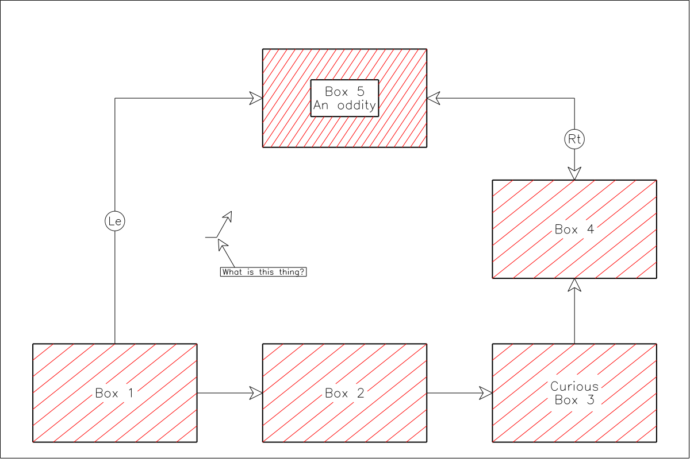

```
RESET
BOUNDS 0 42 0 26

CSG TEXT
COL 0 0 0
CSG ANNOT
COL 0 0 0
WID 2

BOXPSIZE 10 6 NO

BOXT "B*LOX 1" 7 3
BOXT "B*LOX 2" 21 3
BOXT "C*LURIOUS\*UB*LOX 3" 35 3

BOXT "B*LOX 4" 35 13

BOXPHATCH 0.05 8 HORIZ
BOXPBOX BOTH
BOXT "B*LOX 5\*UA*LN ODDITY" 21 21

CSG GEN
COL 0 0 0
ARROWPARM BARBED 0.8 2 0.3
LINEPARM 0.5 1.5
LINE P12,3>A16,3
LINE P26,3>A30,3
LINE P35,6>A35,10
LINE A35,16>P35,21,R*LT>A26,21
LINE P7,6>P7,21,L*LE>A16,21

LINE P12.5,12.5>P13.2,12.5>A14.1,14.1
ALABEL 13.2 12.5 2 300 "What is this thing?"

OUTLINE DEVICE
```

It may look painful to create a diagram such as this by entering coordinates, and
perhaps it is. However, it may be less painful than it seems at first. A key simplification
is to use an integer coordinate system with the box size a useful multiple of the unit size
(e.g. so that middle of the box edges is easy to find). It is also helpful to have a
grid printed out (!) with the coordinate system shown over a specified range (`BOUNDS`). As
an aid to this, the script `OBGRID` can draw such a grid which can be used as the background
of the diagram as it is developed (e.g. using the `gterm` device) or printed to help sketch
out the diagram.

Surely it would be easier to just use, say, Inkscape? Perhaps. I have drawn many block 
diagrams with Inkscape and in some ways it is obviously easier. But it still takes longer
than might be expected to get to a "final" result. It is also very difficult (at least 
for me) to get lines and boxes to "snap" together precisely (I usually give up on perfecting
this, to be honest). The GPLOT approach at least results in exact alignment of all elements!
In summary, I'm not sure it is all that more time consuming to get to an acceptable result.
Which approach you prefer (using a mouse and relying on hand/eye coordination or working
out and typing in coordinates) is a matter of personal taste. Obviously, if you want to draw
a portrait of your dog, Inkscape (or a similar program) is the only sane choice! For more
exactly defined tasks, a "language based" approach can make sense, as proved by the success
of vector graphics description languages such as PGF/Tikz.


```
#
# DRAW A GRID WITH NUMBERED AXES. USEFUL FOR BLOCK DIAGRAMS.
# CALL WITH BOUNDS AS PARAMETERS.
#
BOUNDS $1 $2 $3 $4
CSG ALL
COL 0.8 0.8 0.8
STRING 9 "(I2)"
ITEVAL $3 $4 1 "$1,I,M,$2,I,D"
ITEVAL $1 $2 1 "I,$3,M,I,$4,D"
ITEVAL $3 $4 1 "$4,$3,-,100,/,TH,$1,I,M,I,9,TVI"
ITEVAL $1 $2 1 "$4,$3,-,100,/,TH,I,$3,0.5,+,M,I,9,TVI"
```

For a more sophisticated example of a block diagram drawn with GPLOT, look at the
script `OBMODIO` which draws the block diagram at the top of this document showing
the component parts of the Git-MODIFY inter-operability scheme.

An example of using GPLOT (primarily `BOXTEXT`) to produce a drawing other than a
block diagram is shown below. This documents the key bindings for the NOS 2 Full
Screen Editor with a Macbook laptop keyboard.


Further examples of how the "higher level drawing" features can be used can be seen
in the `OBCHT1` and `OBCHT2` scripts which generate the GPLOT "cheat sheet" which can
be found at the end of this document.


### L-Systems

L-systems or Lindenmeyer systems are a type of formal grammar (as in mathematical logic)
developed by Aristid Lindenmeyer, a theoretical biologist, in 1968 to model the processes
of plant development. They can be used to generate a variety of attractive images, beyond
plants and trees, including self-similar fractals. See this 
[Wikipedia](https://en.wikipedia.org/wiki/L-system) article for more
background information.

Lindenmeyer systems generating 2D vector graphics are included in GPLOT. The implementation
is based on Paul Bourke's description of a 1991 commercial product (probably now long dead)
which can be found [here](https://paulbourke.net/fractals/lsys/). As with many of Paul Bourke's
web pages, this is very informative and inspirational.

L-systems work by manipulating strings, the characters of which either represent graphical actions
(such as moving forward, drawing a line, or turning through an angle) or are "variables" with no
associated graphical meaning.

An L-system is defined by an "axiom string" and a set of "re-writing rules", and, in our case,
also a fixed "turning angle". The "axiom string" must be set in string register 1 and up to
8 "re-writing rules" can then appear in string registers 2 to 9 (used consecutively). The initial
line angle is set by storing the angle (in degrees) in numeric register 3.

The characters allowed ("vocabulary") are: `F A B C D E M X Y + - [ ]` Seven of these are associated
with specific actions. Any alphabetic character can be substituted with a string by a re-writing
rule. The seven "action characters" are:

- `F` - draw a unit length line segment at the current drawing angle.
- `D` - as `F`, but some systems need two substitutable drawing characters.
- `M` - move by a unit length at the cureent drawing angle.
- `+` - turn counter-clockwise by the turning angle.
- `-` - turn clockwise by the turning angle.
- `[` - push the current position and drawing angle on a stack.
- `]` - pop the current position and drawing angle off a stack.

This is all very abstract, of course! Paul Bourke's web page gives a simple example which is
quite easy to follow, but more complex systems are not obvious (to me, anyway). 

Here is a classic example of a plant drawn with an L-system:


```
# PROCEDURE TO DRAW AN ALGORITHMICALLY DEFINED
# PLANT USING A LINDENMAYER SYSTEM.
# USAGE:
#  OBEY OBPLANT <ITERATIONS>
#   ITERATIONS BETWEEN 5 AND 8 SEEMS REASONABLE.

# INITIALISE GPLOT STATE.
RESET
GRAPHMODE ON

# SET THE COLOUR OF THE PLANT.
CSG GENERAL
COL 0.05 0.6 0.03

# DEFINE THE LINDENMAYER SYSTEM FOR THE PLANT.
STRING 1 X
STRING 2 F:FF
STRING 3 X:F-[[X]+X]+F[+FX]-X 
STO 3 90

# DRAW THE PLANT
LSYSTEM 2 $1 22.5

# SETUP TO ADD ANNOTATION
GRAPHMODE OFF
BOUNDS 0 1.33 0 1
CSG TEXT
COL 0 0 0

# DEMONSTRATE CTEXT CENTRED TEXT.
MOVE 0.3325 0.265
CTEXT 0.532 "L*LINDENMAYER *UP*LLANT"
MOVE 0.3325 0.185
CTEXT 0.4655 "X, F:FF, X:F-[[X]+X]+F[+FX]-X, 22.5*L DEGREES, $1 ITERATIONS."

# DEMONSTRATE ROTATED TEXT VIA THE RPN EVALUATOR.
STRING 5 "GPLOT/DIMFILM D*LEMONSTRATION AND TEST SCRIPT"
STRING 6 "  DIMFILM 1972-95, GPLOT 2013-"
EVAL "1.31,0.05,M,90,TA,5,T,1.31,0.6,M,6,T"

# ADD THE GPLOT VERSION INFO, DRAWING CENTRED TEXT
# VIA A STORED PROCEDURE.
VERSION 9
LOADP 1 ECTEXT
EVAL @1 "0.3325,0.125,0.45,9"

OUTLINE DEV
```

Note that, in general, the complexity of the drawing explodes as the number
of iterations increases. The GPLOT L-system implementation uses scratch files
to avoid memory limitations on NOS, so large outputs are possible, but the
compute times also explode! The maximum stack depth is set to 20, although this
doesn't seem to be much of a limitation in practice.

Here are some other examples. 

A complicated, bristly plant:


```
RESET

# SET THE COLOUR OF THE PLANT.
CSG GENERAL
COL 0.05 0.6 0.03

# DEFINE THE LINDENMAYER SYSTEM FOR THE PLANT.
STRING 1 ABFFF
STRING 2 A:[+++C][---C]YA
STRING 3 C:+X[-C]B
STRING 4 X:-C[+X]B
STRING 5 Y:YB
STRING 6 B:[-FFF][+FFF]F

# INITIAL DRAWING ANGLE.
STO 3 90

# DRAW.
LSYSTEM 5 $1 20
```

A Minkowski island, after 4 iterations. L-systems can generate most
(all?) fractal curves. Several suck curves follow.


```
RESET

STRING 1 F+F+F+F
STRING 2 F:F+F-F-FF+F+F-F

STO 3 0

CSG GENERAL
COL 0.9 0 0.1

LSYSTEM 1 $1 90
```

A Sierpinski gasket after 6 iterations.


```
RESET

STRING 1 F+F+F        ; AXIOM
STRING 2 F:F-F+F+F-F  ; GENERATOR

STO 3 0               ; INITIAL ANGLE

CSG GENERAL
COL 0.9 0 0.1

# DRAW THE GASKET
LSYSTEM 1 $1 120
```

A Koch "snowflake" drawn with rectangular elements.


```
RESET

STRING 1 F+F+F+F
STRING 2 F:FF+F-F+F+FF

STO 3 0

CSG GENERAL
COL 0.9 0 0.1

LSYSTEM 1 $1 90
```

A Gosper curve, or "flowsnake", after 4 iterations.


```
RESET

STRING 1 F
STRING 2 F:F-D--D+F++FF+D-
STRING 3 D:+F-DD--D-F++F+D

STO 3 90

CSG GENERAL
COL 0.9 0 0.1

LSYSTEM 2 $1 60
```

GPLOT cheat sheet
-----------------

GPLOT has quite a few commands and facilities. It is fully documented
in a PDF format manual (LaTeX source for this can be found in the 
`doc/gplot` directory).

A quick guide in the form of a two page "cheat sheet" (drawn by GPLOT)
is provided here, however. This is often sufficient as a reminder of
the details when trying to do something.


Fonts
-----

### Alphabetic font tables


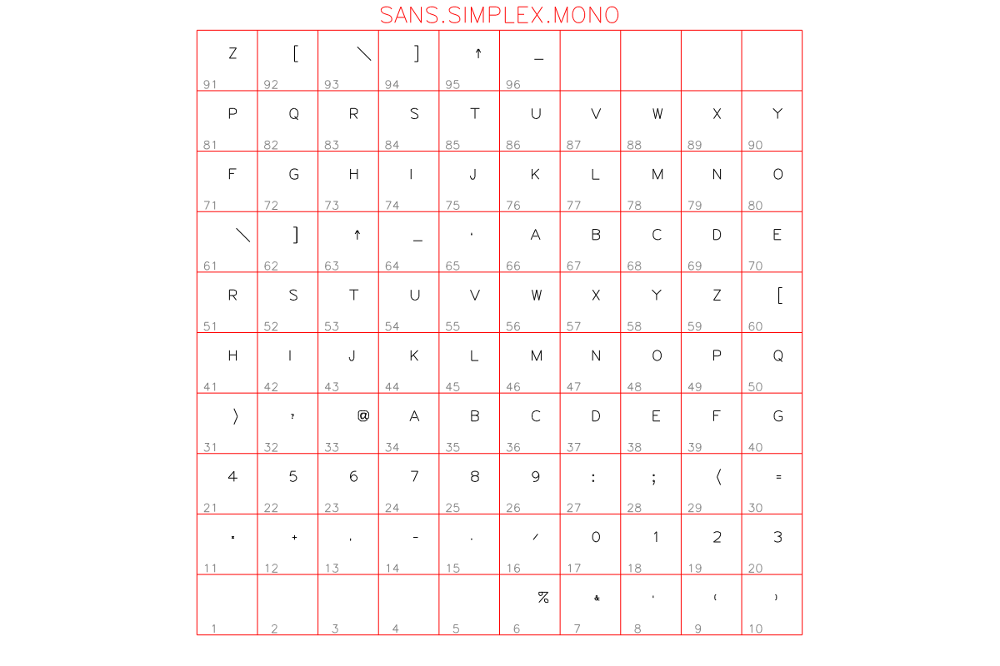


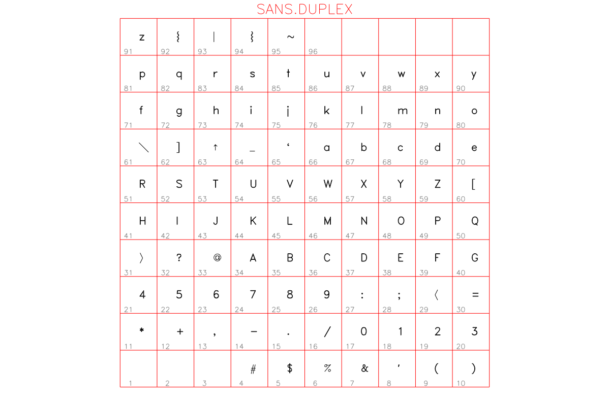

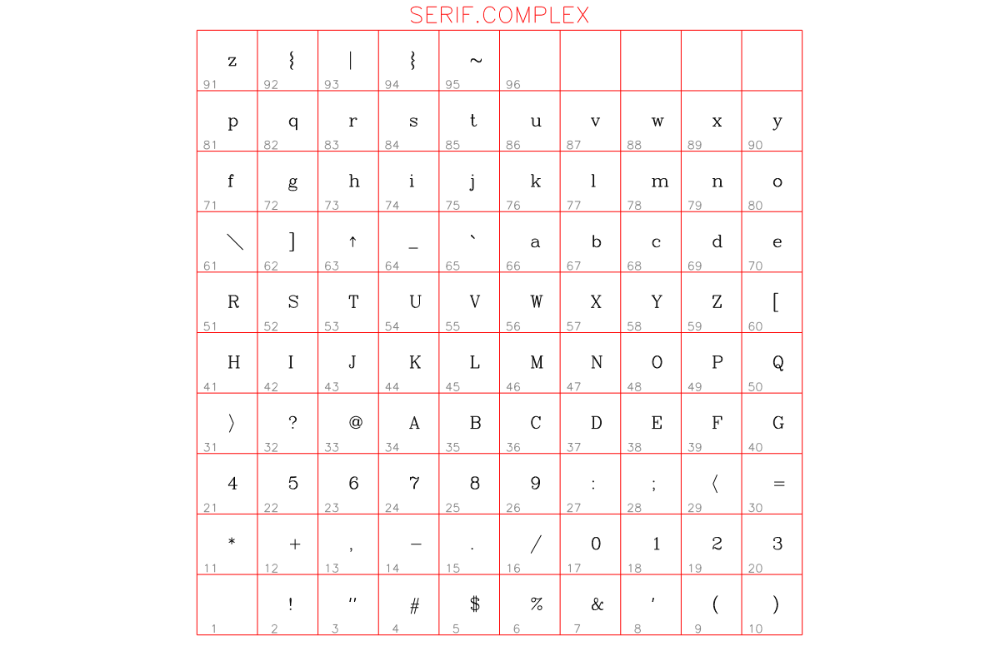


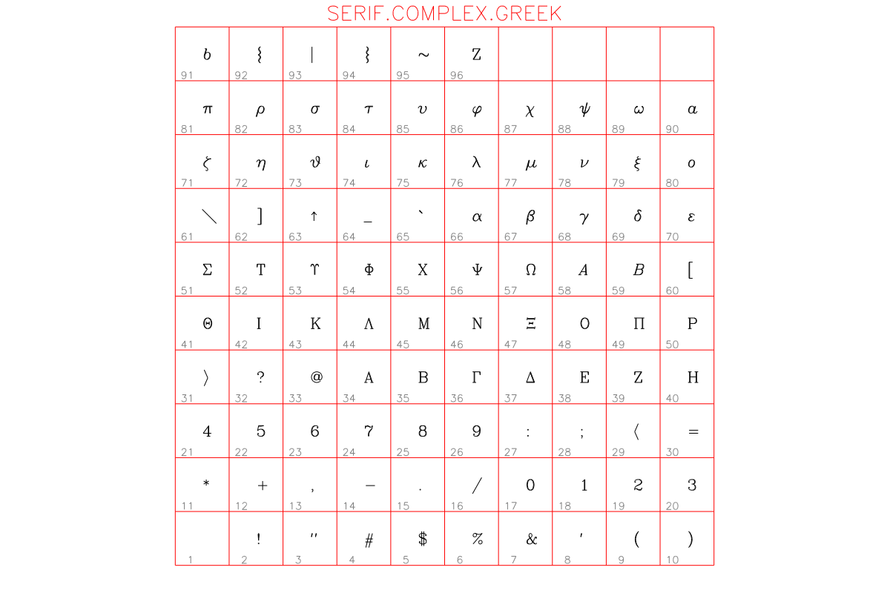


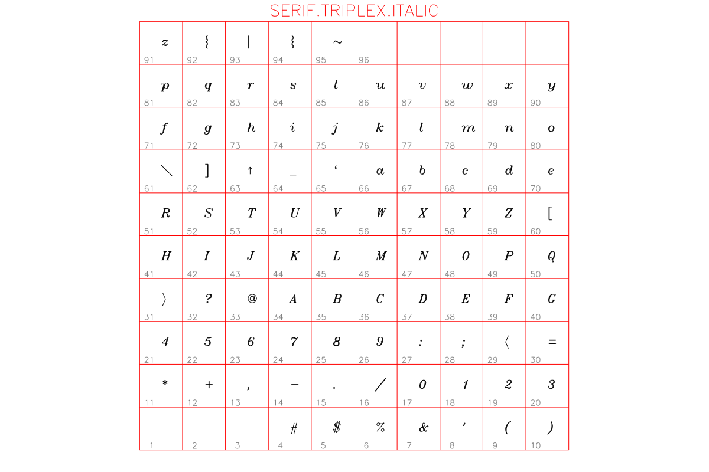


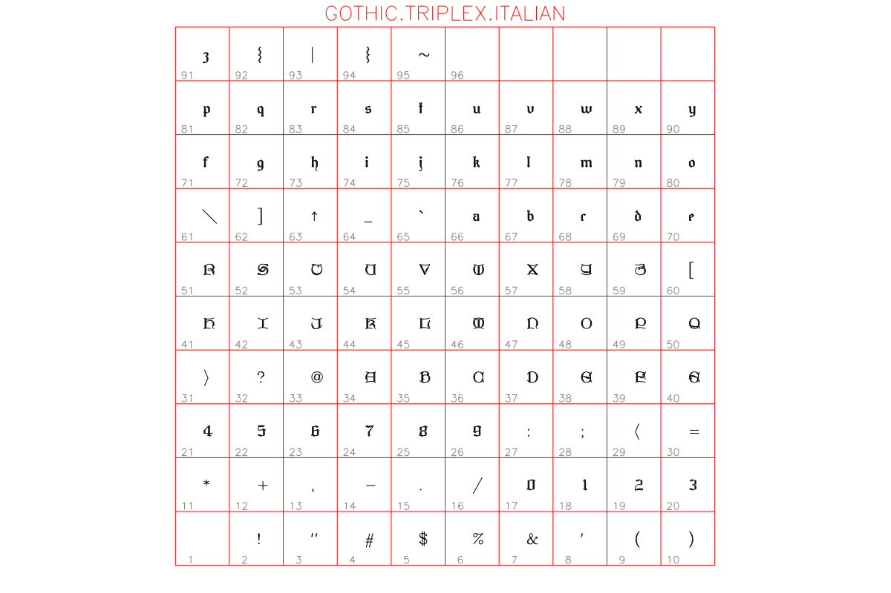


### Symbol font tables


### Marker font tables


